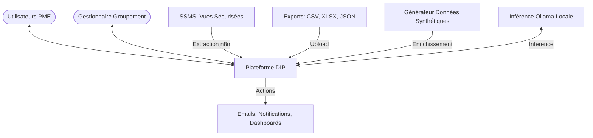
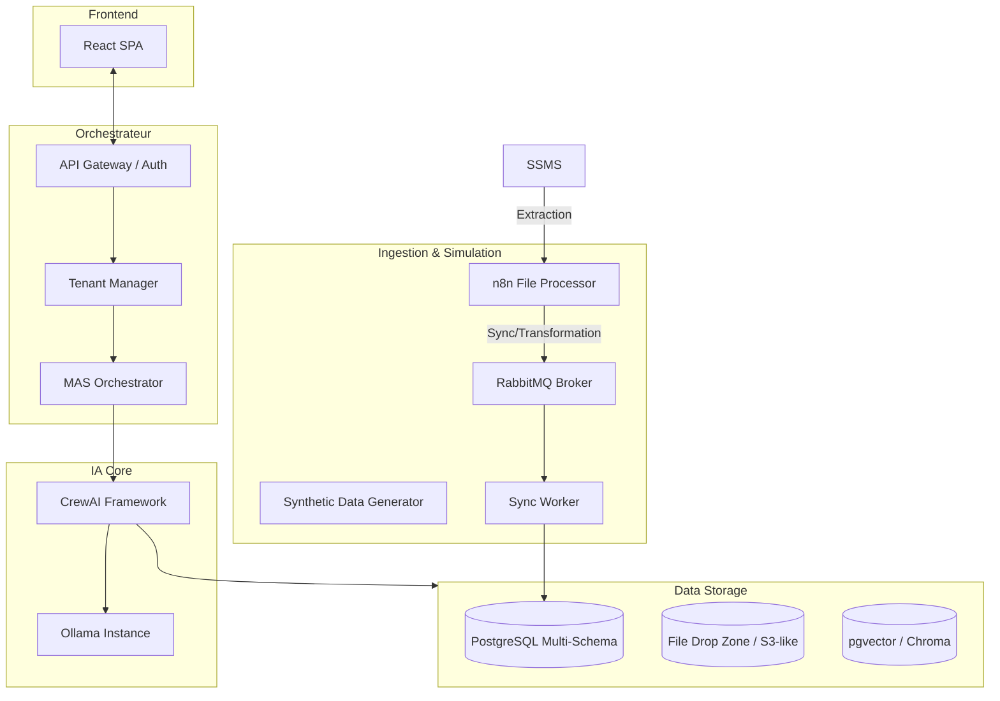
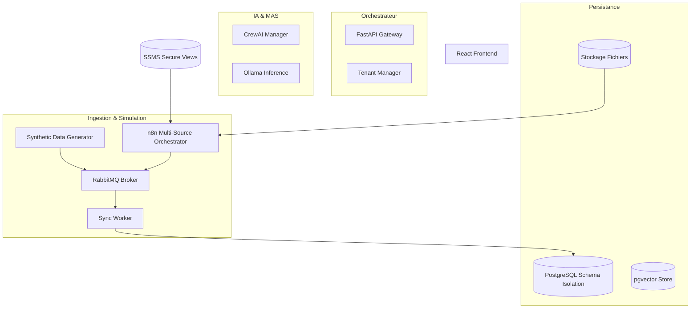
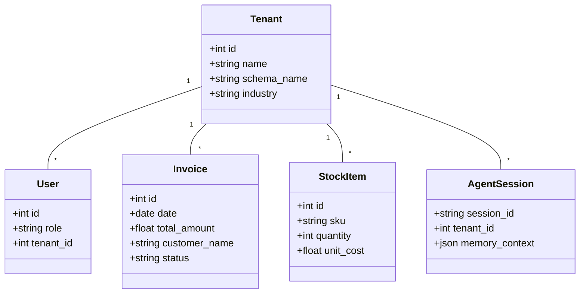
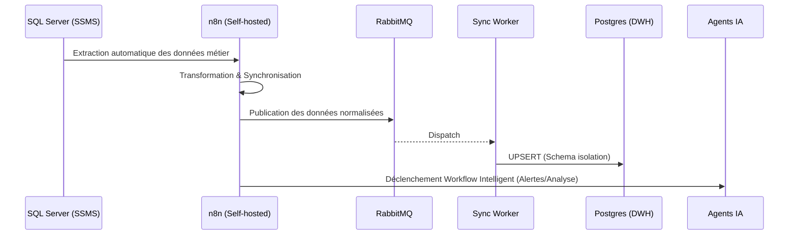
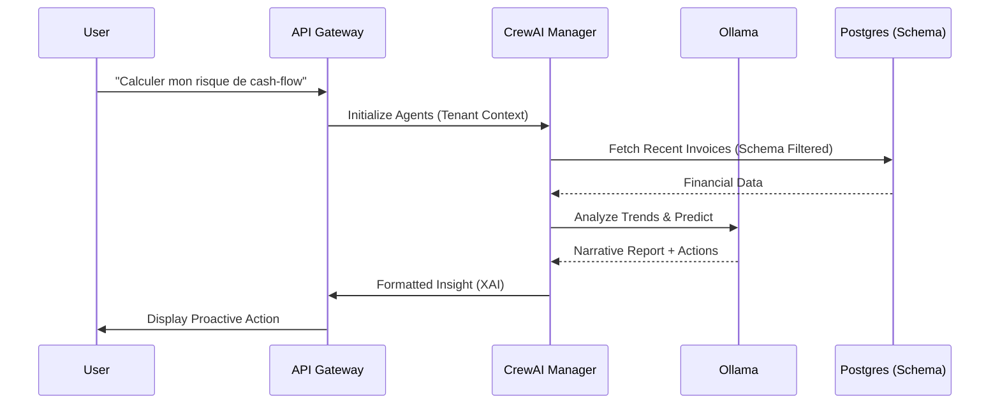
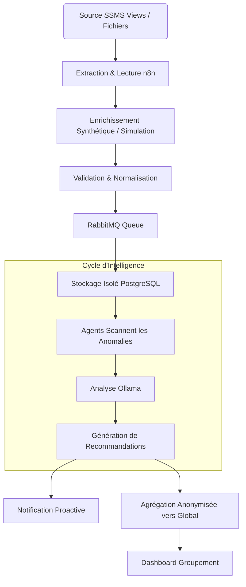
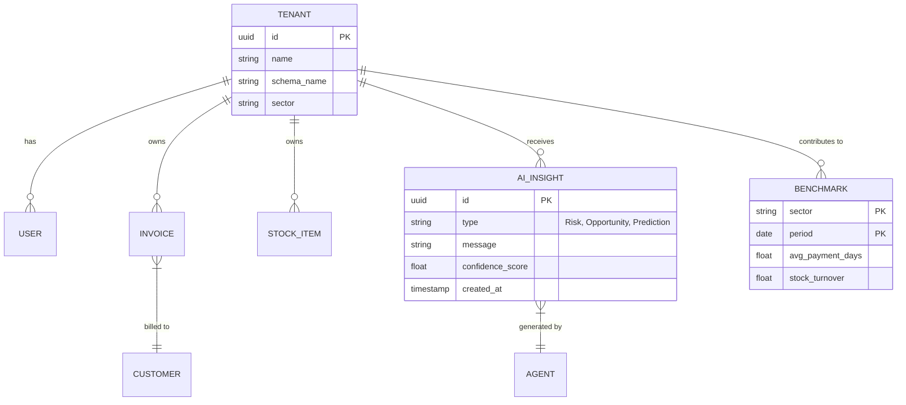
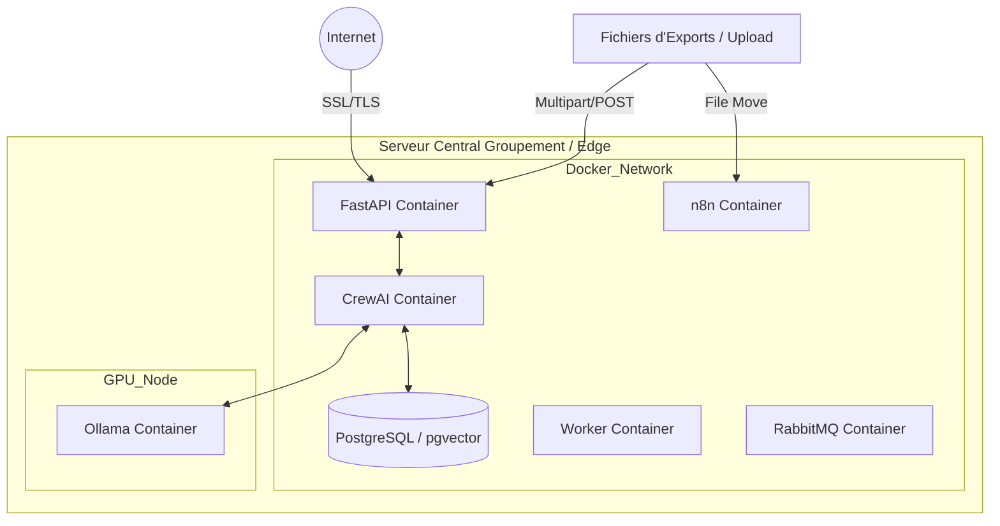

# Dossier d'Architecture Technique Complet (DIP)

**Projet :** Decision Intelligence Platform (DIP) pour PME Multi-Tenant
**Date :** 21 Mai 2026
**Auteur :** Mahmoud

---

## 1. Diagramme de Contexte
Le diagramme de contexte définit les frontières du système et ses interactions avec les acteurs externes.

---

## 2. Architecture des Composants (Component Architecture)
Une vue modulaire des briques logicielles composant le système.

---

## 3. Diagramme des Composants (Détaillé)
Détaille les interfaces et les dépendances entre sous-systèmes.

---

## 4. Diagramme de Classes (Domaine)
Représentation des entités principales du modèle de données pivot.

---

## 5. Diagrammes de Séquence (Flux critiques)

### 5.1 Ingestion et Orchestration ETL (SQL Server -> n8n -> PostgreSQL)

### 5.2 Requête Agent IA

---

## 6. Diagramme d'Activités Global
Processus de transformation de la donnée brute en intelligence actionnable.

---

## 7. Modèle Entité-Association (ERD)
Schéma détaillé des relations en base de données.

---

## 8. Diagramme de Déploiement
Infrastructure physique et conteneurisation.

---

## 9. Stack Technologique (Tech Stack)

Le choix des technologies est guidé par les principes de **souveraineté**, de **modularité** et de **performance locale**.

| Couche | Technologie(s) | Justification |
| :--- | :--- | :--- |
| **Frontend** | React, TailwindCSS, Shadcn/UI | UX moderne, réactive et composants réutilisables pour les dashboards. |
| **Backend / API** | Python (FastAPI), Pydantic | Performance élevée (async), documentation automatique et typage fort. |
| **IA / LLM Local** | Ollama, Llama 3 / Mistral | Inférence locale pour la confidentialité des données et la souveraineté. |
| **MAS Framework** | CrewAI | Orchestration d'agents autonomes avec gestion de rôle et processus. |
| **Base de Données** | PostgreSQL (Multischema), pgvector | Isolation forte par schéma et stockage vectoriel intégré pour le RAG. |
| **Source de Données** | SQL Server (SSMS) | Centralisation des données métier existantes. |
| **Orchestration ETL** | n8n (Self-hosted) | Orchestrateur ETL entre SQL Server et la plateforme. Automatise l'extraction, la transformation, la synchronisation et déclenche les workflows IA. |
| **Message Broker** | RabbitMQ | Résilience et lissage des flux d'ingestion asynchrones. |
| **Déploiement** | Docker, Docker Compose | Portabilité et isolation des services sur infrastructure locale. |
| **Observabilité** | Langfuse | Monitoring des performances des agents et traçabilité des coûts d'inférence. |

---

## 10. Synthèse des Stratégies Techniques

*   **Isolation :** Utilisation de schémas PostgreSQL pour garantir l'étanchéité totale entre PME.
*   **Agnosticisme & Confidentialité :** Couche de transformation n8n exploitant des Vues SQL filtrées. Le système ne manipule que les métadonnées nécessaires à la décision, préservant le secret industriel original.
*   **Intelligence Hybride :** Utilisation de données synthétiques pour compenser les restrictions d'accès, garantissant que les agents CrewAI disposent d'un historique d'entraînement suffisant.
*   **Intelligence Souveraine :** Déploiement local d'Ollama via Docker pour assurer que les informations extraites des vues sécurisées ne quittent jamais l'infrastructure du groupement.
*   **Scalabilité :** Utilisation de RabbitMQ pour lisser les flux d'ingestion et supporter des centaines de PME simultanément.
