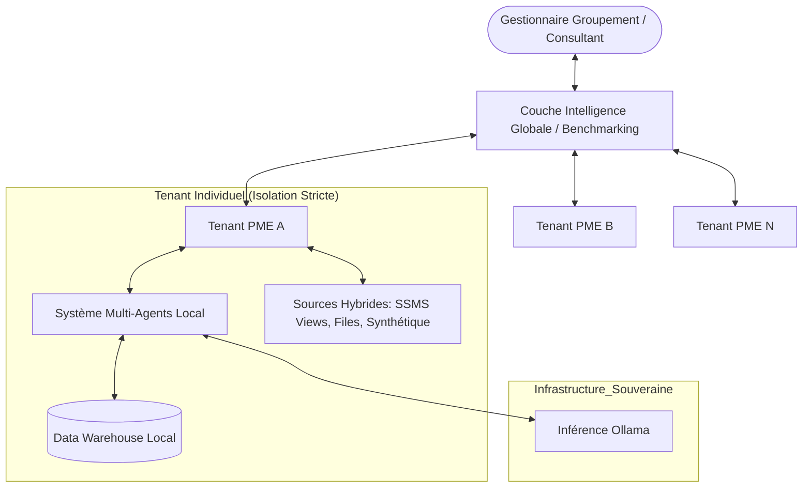
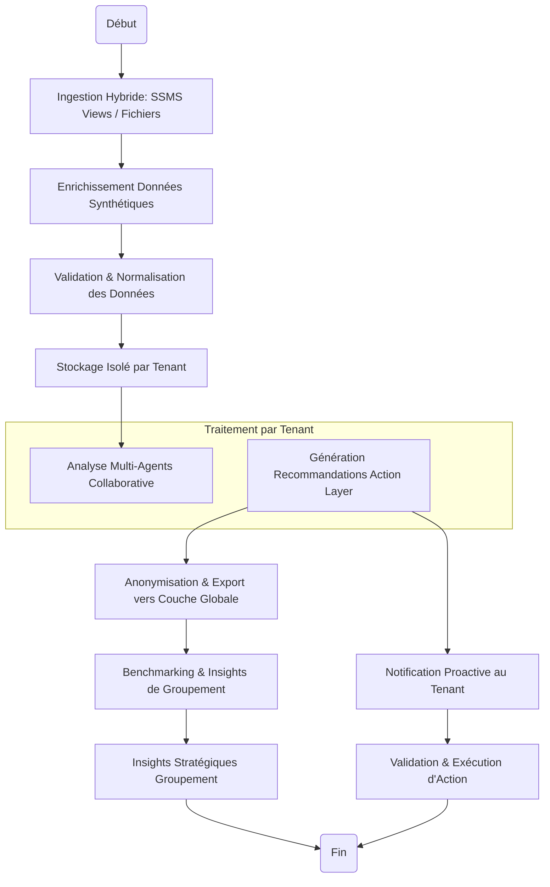

# Product Requirements Document: Multi-Tenant Decision Intelligence Platform (DIP)

**Author:** Mahmoud
**Date:** 2026-05-20

## Executive Summary

Cette plateforme de **Decision Intelligence Multi-Tenant** est conçue pour les organisations, intégrateurs et structures de pilotage gérant un portefeuille de plusieurs PME ou entités clientes. Contrairement aux solutions isolées, notre DIP agit comme un **Agrégateur d'Intelligence** : il offre à chaque entité une couche d'action proactive souveraine tout en permettant à l'organisation centrale de piloter la performance globale via du benchmarking et des analyses agrégées.

### What Makes This Special

Ce qui distingue cette plateforme est son approche de **Système Nerveux Central pour Groupements** :
*   **Architecture Multi-Tenant Native :** Isolation cryptographique et logique stricte des données par PME cliente.
*   **Orchestration ETL Souveraine :** Utilisation de n8n pour orchestrer l'extraction depuis des **Vues SSMS sécurisées** (lecture seule) et l'import de **fichiers exports**.
*   **Conformité Privacy-by-Design :** Architecture optimisée pour travailler sur des sous-ensembles de données filtrées via SQL Views, garantissant que les données sensibles (données personnelles, marges confidentielles) restent dans l'infrastructure source.
*   **Génération de Données Réalistes (Module Simulation) :** Module de complétion de données synthétiques pour enrichir les vues restreintes, permettant de tester les agents CrewAI sur des cycles financiers complets (ex: simuler des retards de paiement non fournis dans les vues).
*   **Couche d'Intelligence Globale :** Capacité unique de benchmarking anonymisé entre entités pour identifier les meilleures pratiques.
*   **IA Souveraine (Local-First) :** Utilisation d'Ollama pour l'inférence locale, garantissant la confidentialité absolue des données financières.

## Success Criteria

### Aggregator & User Success
*   **Pilotage de Portefeuille :** L'organisation centrale peut visualiser la santé financière et opérationnelle de 100% de ses entités gérées via un tableau de bord agrégé.
*   **Benchmarks Actionnables :** Capacité à identifier des écarts de performance entre entités similaires et à suggérer des corrections automatisées.

### Business Success
*   **Scalabilité :** Capacité à onboarder une nouvelle entité cliente (tenant) avec synchronisation de ses sources de données en moins de 4 heures.
*   **ROI Agrégé :** Amélioration globale de la trésorerie du groupement de 15% via l'optimisation des flux de recouvrement.

### Technical Success
*   **Zéro Fuite de Données :** Validation par audit de l'étanchéité totale entre les données des différents tenants.
*   **Performance Inférence :** Temps de réponse IA < 15s par requête, même avec une montée en charge du nombre de tenants.

## User Journeys

### 1. Selim (Consultant / Gestionnaire de Groupement)
Selim gère un portefeuille de 15 PME industrielles. Le matin, il n'ouvre pas 15 ERP. Il ouvre sa vue **"Global DIP"**. L'Intelligence Globale l'alerte que 3 de ses entités risquent une crise de liquidité à 15 jours. Il peut immédiatement plonger dans chaque tenant, voir les explications XAI spécifiques et valider les plans d'action de recouvrement recommandés par les agents locaux, le tout depuis une interface unifiée.

### 2. Mourad (Dirigeant d'une PME Cliente) - Le Copilote
Mourad utilise la plateforme mise à disposition par son groupement. Ses données Odoo sont ingérées automatiquement. Il bénéficie de l'agent Finance qui lui propose des actions proactives de Cash Recovery. Le moment "Aha!" survient lorsqu'il voit qu'il peut comparer ses délais de livraison avec la moyenne anonymisée du groupement, identifiant ainsi un point faible de son processus qu'il n'avait jamais remarqué.

### 3. Sarah (Admin IT Intégrateur) 
Sarah configure un nouveau tenant pour une PME. Elle injecte les données via les **Vues SQL Server dédiées** fournies par l'IT ou importe des fichiers CSV. Elle utilise le générateur pour compléter les données si les vues sont trop restreintes pour l'entraînement des agents. Elle définit les règles d'isolation dans le module multi-tenant et surveille la charge des instances Ollama locales.

## Domain-Specific Requirements

### Sécurité & Isolation (Multi-Tenant)
*   **Isolation stricte :** Utilisation de schémas de base de données séparés ou de clés de tenant obligatoires au niveau de la couche d'accès aux données.
*   **Chiffrement par Tenant :** Chaque entité peut disposer de ses propres clés de chiffrement pour ses données au repos.

### Ingestion Agnostique
*   **Interface Universelle :** Mise à disposition d'une API d'ingestion standardisée et de processeurs de fichiers structurés (CSV/JSON/Parquet).
*   **Normalisation :** Couche de mapping dynamique pour transformer les données hétérogènes des ERP (Odoo, Sage, etc.) en un modèle de données pivot pour le Data Warehouse.

### Risques & Atténuations
*   **Fuite de Contexte IA :** Les prompts envoyés à Ollama doivent être rigoureusement filtrés pour ne jamais inclure de données provenant d'un autre tenant.
*   **Incomplétude des Vues SQL :** Si les vues SSMS sont trop restrictives, les agents pourraient produire des analyses biaisées. *Atténuation* : Utilisation du module de simulation pour "boucher les trous" avec des données synthétiques statistiquement cohérentes.
*   **Dépendance de Connectivité :** Gestion robuste des files d'attente (n8n/RabbitMQ) pour supporter des synchronisations asynchrones vers les vues SSMS distantes.

## High-Level Diagrams

### Diagramme de Contexte (Multi-PME)

### Diagramme d'Activités (Flux Multi-Tenant)

## Functional Requirements

### 1. Gestion Multi-Tenant & Isolation
*   **FR1 :** Le système doit garantir l'isolation logique et physique (si configuré) des données entre chaque tenant.
*   **FR2 :** L'administrateur de groupement peut créer, suspendre et configurer des tenants individuels.
*   **FR3 :** Le système doit permettre une gestion RBAC hiérarchisée (Permissions globales vs Permissions locales au tenant).

### 2. Ingestion & Connectivité Universelle
*   **FR4 :** Le système doit proposer un portail d'upload pour les fichiers exports standards (CSV, XLSX, JSON).
*   **FR5 :** Le système doit inclure un **Générateur de Données Synthétiques** capable de produire des jeux de données cohérents (Factures, Stocks, Ventes) pour simuler un ERP.
*   **FR6 :** Le système doit utiliser des workflows n8n pour valider la structure des fichiers entrants avant l'injection en base.

### 3. Intelligence de Groupement (Aggregator Layer)
*   **FR7 :** Le système peut agréger des données anonymisées de plusieurs tenants pour produire des indicateurs de benchmarking sectoriels.
*   **FR8 :** Le système doit identifier et notifier l'organisation centrale des tendances ou anomalies détectées à l'échelle du portefeuille.
*   **FR9 :** Le système doit permettre la simulation de scénarios d'impact à l'échelle du groupement.

### 4. Action Layer & MAS Local
*   **FR10 :** Chaque tenant dispose de son propre système multi-agents collaboratif (Finance, Stock, Ventes).
*   **FR11 :** Le système doit générer des résumés narratifs (Storytelling) pour chaque tenant, accessibles par le gestionnaire de groupement.
*   **FR12 :** Chaque action proactive recommandée doit être accompagnée de son explication XAI basée uniquement sur les données du tenant.

## Non-Functional Requirements

### Sécurité & Confidentialité
*   **NFR1 :** Zéro transit de données brutes identifiables entre tenants ou vers un cloud public non-maîtrisé.
*   **NFR2 :** Chiffrement obligatoire de bout en bout (transit et repos).
*   **NFR3 :** Piste d'audit immuable incluant le contexte du tenant et l'identité de l'initiateur (humain ou agent).

### Scalabilité & Performance
*   **NFR4 :** L'architecture doit supporter l'ajout horizontal de tenants sans dégradation linéaire des performances.
*   **NFR5 :** Temps de réponse NLI (Natural Language) < 10s pour les requêtes globales.

## Project Scoping & Phased Development

### Phase 1 : Core Aggregator MVP
*   Moteur Multi-Tenant et isolation des données.
*   API d'ingestion agnostique et connecteur Odoo.
*   MAS Local (Finance) avec action Cash Recovery.
*   Tableau de bord de groupement basique.

### Phase 2 : Growth & Benchmarking
*   Couche de Benchmarking anonymisée.
*   MAS Local (Stock) et orchestration collaborative.
*   Storytelling narratif et simulations "What-If" locales.

### Phase 3 : Autonomous Ecosystem
*   Autonomie supervisée et exécution automatique globale.
*   Insights macro-économiques croisant les données du groupement avec des sources externes.
