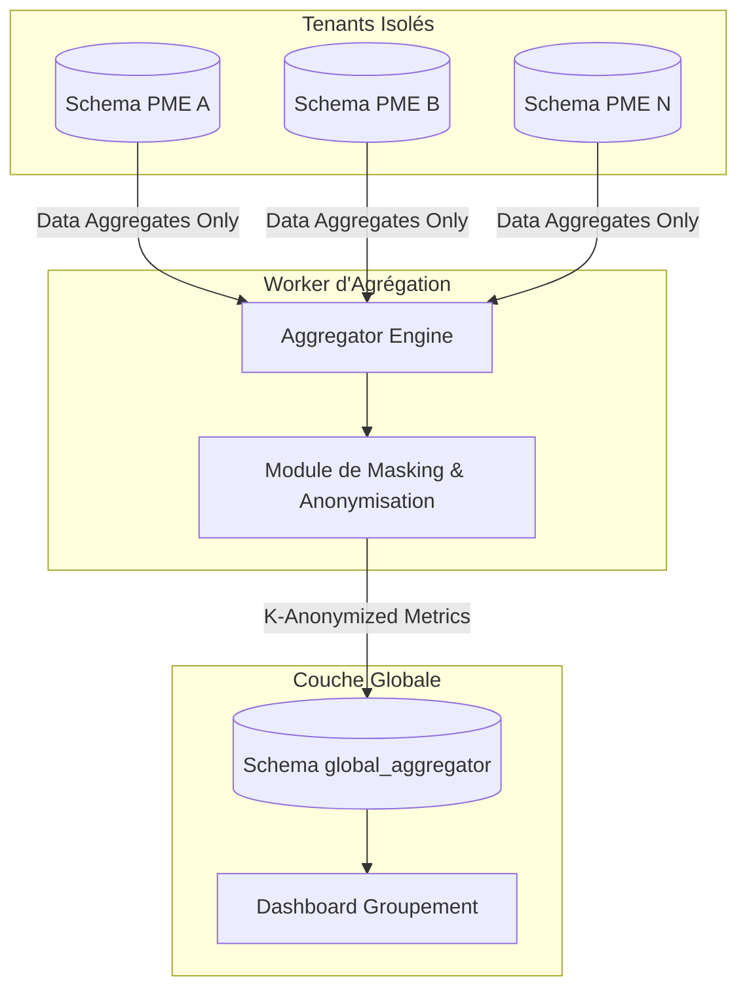

# Research Report: Architecture d'Aggrégation et Benchmarking Anonymisé

**Date:** 2026-05-21
**Author:** Mahmoud
**Research Type:** technical

---

## 1. Processus d'Extraction et Anonymisation (Pipeline ETL)

L'architecture repose sur un principe de **Data Exfiltration Sécurisée** : les données quittent le schéma isolé du tenant uniquement sous forme agrégée et anonymisée.

### Étapes du Pipeline
1.  **Extraction Locale (Per Schema) :** Un worker SQL calcule des KPIs prédéfinis au sein de chaque schéma (ex: `AVG(days_to_pay)`).
2.  **Anonymisation stricte :**
    *   Suppression de tous les champs PII (Personally Identifiable Information) : noms de clients, fournisseurs, adresses.
    *   Hachage des IDs pour permettre un suivi temporel anonyme sans révéler l'identité réelle.
3.  **Généralisation Sectorielle :** Les données sont taguées avec un code secteur (ex: "Industrie Textile") et une région, mais sans le nom de la PME.

---

## 2. Infrastructure de Benchmarking (Global Layer)

Toutes les données anonymisées sont consolidées dans un schéma PostgreSQL dédié : `global_aggregator`.

### Data Model Global
*   **Table `sector_benchmarks` :** Stocke les moyennes et centiles par secteur d'activité.
*   **Table `anonymized_tenant_performance` :** Permet à une PME de comparer ses propres KPIs (via son `tenant_id_hash`) par rapport aux autres, sans savoir qui sont les autres.

### Sécurité & Confidentialité (K-Anonymity)
Pour éviter qu'on puisse deviner l'identité d'une PME dans un secteur peu représenté, nous appliquons la règle du **K-Anonymat** :
> Un benchmark sectoriel ne s'affiche que si au moins **5 PME distinctes** de ce secteur ont fourni des données. En dessous de ce seuil, les données sont fondues dans une catégorie "Autres secteurs".

---

## Architecture Diagram: Benchmarking & Aggregation Flow

---

## Next Steps: Synthesis of Final Technical Architecture

Toutes les briques technologiques critiques ont été étudiées :
*   **Isolation :** Multi-schéma PostgreSQL.
*   **IA :** Orchestration Ollama par session.
*   **Flux :** Ingestion asynchrone n8n + RabbitMQ.
*   **Intelligence :** Benchmarking anonymisé via ETL sécurisé.

Nous pouvons maintenant passer à la conception de l'**Architecture Technique Finale**.

