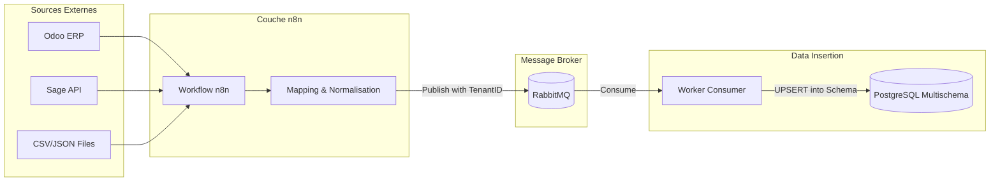

# Research Report: Workflows d'Ingestion Asynchrones (n8n & RabbitMQ)

**Date:** 2026-05-21
**Author:** Mahmoud
**Research Type:** technical

---

## 1. Stratégie d'Ingestion Agnostique (n8n)

n8n servira de "Glue" pour connecter les sources de données hétérogènes des PME à notre plateforme.

### Connectivité ERP
*   **Odoo :** Utilisation du noeud natif n8n (XML-RPC) ou via le module "El Fatoora" pour capter les factures dès leur émission.
*   **Sage / SAP B1 :** Ingestion via API REST (si disponible) ou via des agents de synchronisation locaux déposant des fichiers CSV/JSON sur un Webhook n8n sécurisé.

### Normalisation & Mapping (Pivot Model)
Pour éviter de multiplier les structures de tables, n8n effectue un mapping vers un **Modèle de Données Pivot** unique avant l'injection :
1.  **Extraction** des données brutes (Extract).
2.  **Mapping** des champs (ex: `amount_total` chez Odoo -> `total_amount` dans notre pivot).
3.  **Validation** des types et formats (Transform).

---

## 2. Robustesse et File d'Attente (RabbitMQ)

L'introduction de RabbitMQ entre n8n et la base de données PostgreSQL garantit la résilience du système face à des pics de charge ou des pannes temporaires.

### Architecture à 3 Couches
1.  **n8n Producers :** Poussent les données transformées (JSON) vers une queue RabbitMQ unique `raw_ingestion_queue`.
2.  **RabbitMQ Broker :** Stocke les messages de manière persistante.
    *   *Routing Key :* Utilisation de `{tenant_id}.{data_type}` pour permettre une consommation sélective si besoin (ex: traiter les factures en priorité sur les stocks).
3.  **Consumers (Python/Node) :**
    *   Écoutent la queue.
    *   Récupèrent le `tenant_id` dans le message.
    *   Ouvrent une connexion vers PostgreSQL.
    *   Exécutent `SET search_path = tenant_schema;`
    *   Effectuent un **UPSERT** (Insert or Update) pour garantir l'idempotence des données.

---

## Architecture Diagram: Resilient Ingestion Pipeline

---

## Next Steps: Final Technical Architecture Summary

Nous avons maintenant validé :
1.  L'isolation des données (Postgres Schemas).
2.  L'isolation de l'intelligence (Ollama Multi-Tenant).
3.  La résilience de l'ingestion (n8n + RabbitMQ).

La dernière étape de recherche portera sur l'**Architecture d'Agrégation et Benchmarking** pour produire des insights globaux tout en respectant l'anonymat.

