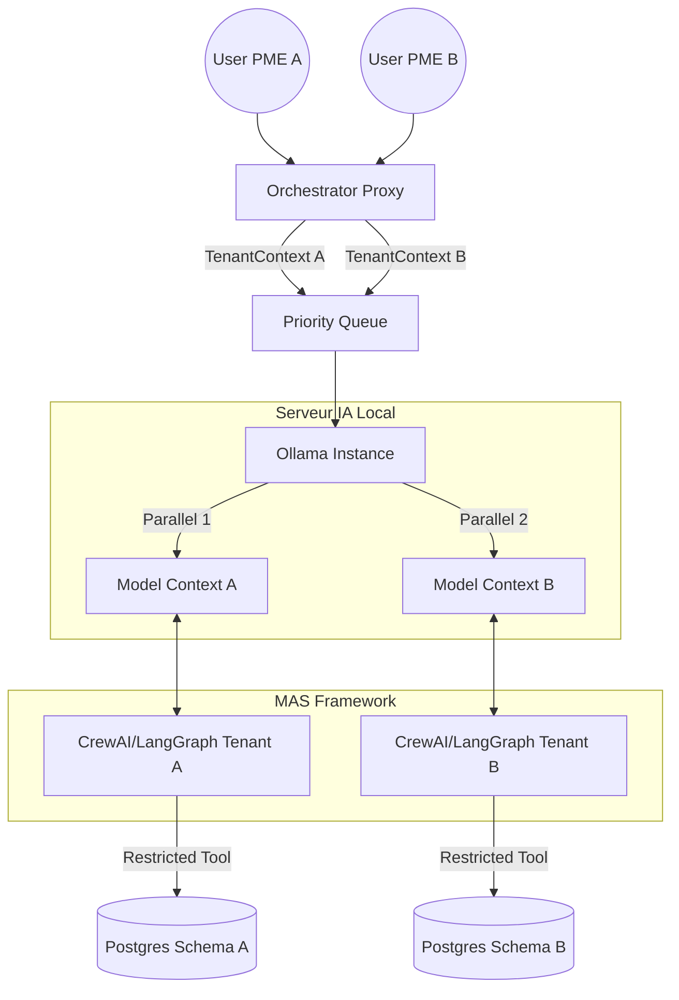

# Research Report: Orchestration LLM Local (Ollama) & MAS Multi-Tenant

**Date:** 2026-05-21
**Author:** Mahmoud
**Research Type:** technical

---

## 1. Orchestration Ollama (Multi-Tenant)

Pour supporter plusieurs tenants (PME) sur un seul serveur local tout en évitant les surcharges, nous devons exploiter les fonctionnalités de parallélisme d'Ollama (version >= 0.1.24).

### Configuration du Parallélisme
*   **OLLAMA_NUM_PARALLEL :** À définir sur `2` ou `4` (selon la VRAM disponible). Cela permet de traiter des requêtes de différents tenants simultanément sans blocage total.
*   **OLLAMA_MAX_LOADED_MODELS :** Utile si différents tenants utilisent des modèles différents (ex: Llama3 pour la finance, Mistral pour le stock).

### Gestion de la File d'Attente (Overload)
Même avec le parallélisme, une forte charge peut saturer le GPU. L'architecture doit inclure un **Proxy d'Orchestration** (FastAPI/Go) qui :
1.  Reçoit la requête du tenant.
2.  Valide l'authentification et récupère le `tenant_id`.
3.  Injecte la requête dans une file d'attente prioritaire si Ollama est saturé.
4.  Renvoie une réponse en streaming pour améliorer l'expérience utilisateur (UX).

---

## 2. Système Multi-Agents (MAS) Par Tenant

Le MAS doit être instancié dynamiquement pour chaque session utilisateur d'un tenant.

### Isolation du Contexte (Prompting)
Chaque agent (Finance, Stock, etc.) reçoit un **Context Header** dynamique :
> "Tu es l'agent Finance de la PME [Nom_Tenant]. Tu travailles dans l'unité monétaire [Devise]. Tes données sont isolées dans le schéma SQL '[Tenant_Schema]'."

### Isolation de la Mémoire (State)
*   Utilisation de **LangGraph** ou **CrewAI** avec un identifiant de session unique (`session_id = tenant_id + user_id`).
*   La mémoire à long terme (checkpoints) est stockée dans PostgreSQL dans le schéma spécifique du tenant.

### Confinement des Outils (Tool Access)
Les agents utilisent des outils (SQL Query, File Read). Pour garantir l'isolation :
*   **SQL Tool :** L'agent ne génère pas de SQL vers n'importe quelle table. L'outil SQL de l'agent doit utiliser une connexion dont le `search_path` est limité au schéma du tenant.
*   **RAG Tool :** Les index vectoriels doivent être filtrés par `tenant_id` (via Metadata filtering dans Chroma/Qdrant or via des schémas séparés dans pgvector).

---

## Architecture Diagram: Multi-Tenant LLM & MAS

---

## Next Steps: Ingestion Workflows (n8n/RabbitMQ)

L'étape suivante consiste à voir comment alimenter ces schémas de manière asynchrone et résiliente, surtout pour les flux ERP complexes (Odoo/Sage).

