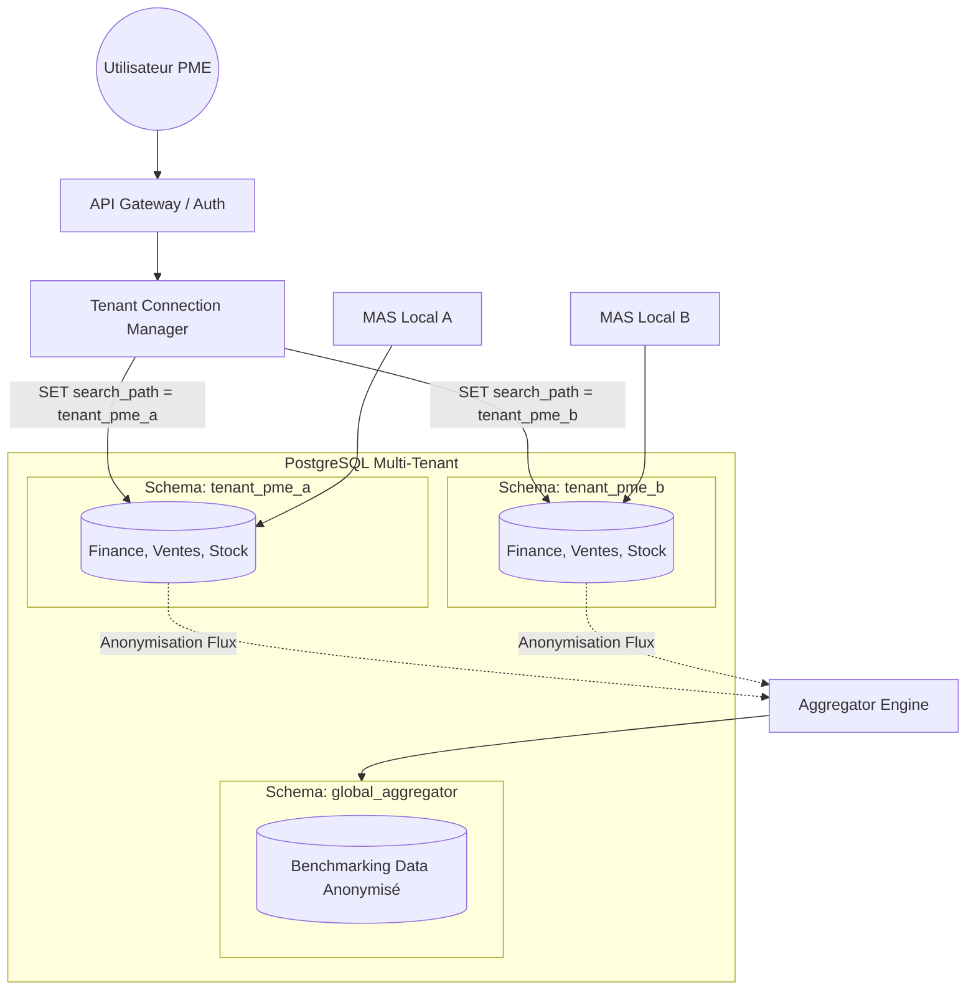

# Research Report: PostgreSQL Multi-Tenant Isolation Strategies

**Date:** 2026-05-21
**Author:** Mahmoud
**Research Type:** technical

---

## Research Overview

Cette recherche technique analyse les différentes stratégies d'isolation de données au sein de PostgreSQL pour répondre aux besoins de la **Plateforme de Decision Intelligence Multi-Tenant**. L'objectif est de garantir une isolation stricte des données financières de chaque PME tout en permettant des analyses agrégées (benchmarking) au niveau du groupement.

### Methodology
- Analyse comparative des documentations officielles de PostgreSQL.
- Revue des meilleures pratiques (Crunchy Data, Timescale, Neon).
- Évaluation spécifique aux besoins des systèmes multi-agents (MAS) et de l'IA locale (Ollama).

---

## Technical Comparison of Isolation Strategies

| Critère | Database per Tenant | Schema per Tenant | Row-Level Security (RLS) |
| :--- | :--- | :--- | :--- |
| **Isolation** | Physique (Stricte) | Logique (Forte) | Logique (Modérée) |
| **Sécurité** | Risque minimal de fuite | Sécurisé via `search_path` | Risque lié aux erreurs de politique |
| **Scalabilité** | Limitée (~50-100 DBs) | Moyenne (~1000s schemas) | Haute (Millions de lignes) |
| **Maintenance** | Très complexe (migrations) | Modérée (migrations itératives) | Simple (migrations standards) |
| **Analytique** | Difficile (besoin d'ETL/FDW) | Facile (Cross-schema joins) | Native (Single table) |
| **Besoins MAS** | Isolation totale du contexte | Contexte agent par schéma | Contexte filtré par clauses WHERE |

### Analysis

1.  **Database per Tenant :** Offre le plus haut niveau de sécurité mais devient un cauchemar opérationnel dès que le nombre de PME dépasse 50. Pour un agrégateur de Decision Intelligence, les calculs de benchmarking seraient extrêmement lents et complexes à orchestrer.
2.  **Schema per Tenant :** Représente le "Goldilocks" pour notre projet. Chaque PME possède ses propres tables, évitant les collisions d'ID et simplifiant l'isolation pour les agents IA (qui pointent vers un schéma spécifique). Le benchmarking peut être effectué via des requêtes cross-schema ou une vue agrégée dans un schéma `public` ou `global`.
3.  **Row-Level Security (RLS) :** Très performant et scalable. Cependant, pour un système financier où l'IA génère des requêtes, le risque qu'une erreur de prompt ou de configuration de politique expose des données d'un autre tenant est plus élevé. L'isolation par schéma offre une barrière plus robuste (Namespace isolation).

## Recommendation for Decision Intelligence Platform

Nous recommandons l'approche **Schema per Tenant** (Pont à travers un schéma `global` pour l'agrégation).

**Justification :**
*   **Sécurité financière :** L'isolation par namespace (schéma) est plus facile à auditer et moins sujette aux erreurs de développeur que les politiques RLS complexes sur des dizaines de tables.
*   **Orchestration MAS :** Chaque agent peut être "confiné" à un schéma spécifique lors de sa connexion, garantissant que ses requêtes SQL (générées via LLM) ne puissent jamais toucher hors de son périmètre sans changer de session.
*   **Benchmarking :** Permet une agrégation simplifiée via des outils comme `n8n` qui peuvent scanner les schémas pour alimenter le Data Warehouse global anonymisé.

---

## Architecture Diagram: Multi-Tenant Schema Strategy

---

## Next Steps: Local LLM Orchestration (Ollama)

Le choix de l'isolation par schéma facilite l'étape suivante : comment servir plusieurs tenants via **Ollama**.
Nous devrons étudier :
*   **Contexte de session :** Comment injecter le `tenant_id` et le schéma cible dans le prompt système de l'agent.
*   **Gestion des ressources :** File d'attente globale pour les requêtes d'inférence afin d'éviter la saturation CPU/GPU du serveur local.
*   **Isolation du cache :** S'assurer que les embeddings (RAG) sont également isolés par schéma/tenant.

