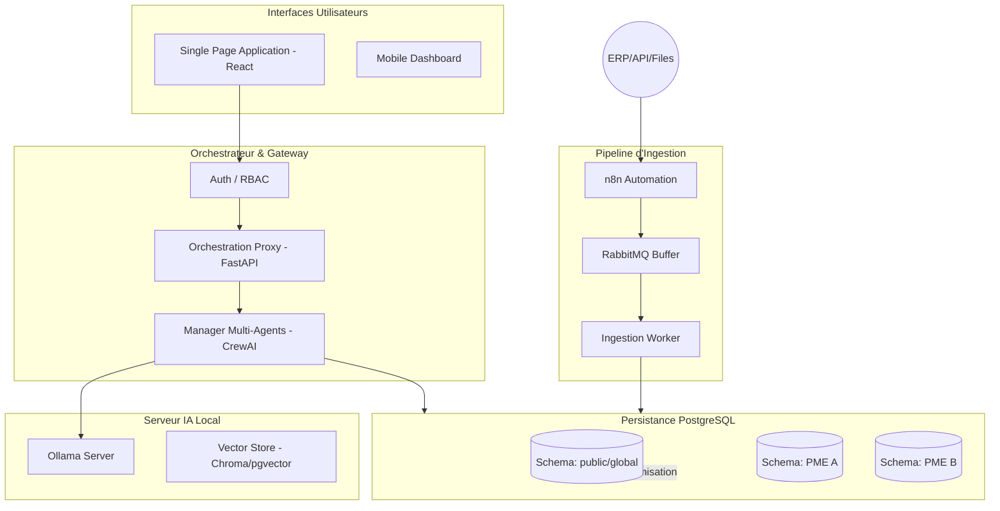

# Architecture Technique Finale : Plateforme de Decision Intelligence Multi-Tenant

**Date :** 21 Mai 2026
**Projet :** Decision Intelligence Platform (DIP) pour PME
**Auteur :** Mahmoud

---

## 1. Vue d'Ensemble de l'Architecture

L'architecture repose sur un modèle hybride de **micro-services centrés sur les données** et de **systèmes multi-agents orchestrés**. La souveraineté des données est garantie par une isolation logique stricte (schémas PostgreSQL) et une inférence IA locale (Ollama).

### Diagramme de l'Architecture Globale

---

## 2. Détails des Composants Critiques

### 2.1 Couche de Données (PostgreSQL Multi-Schema)
*   **Stratégie :** Un schéma par tenant (`tenant_pme_1`, `tenant_pme_2`, etc.).
*   **Isolation :** Utilisation de `SET search_path = tenant_xxx` à chaque connexion établie par le Proxy d'Orchestration.
*   **Modèle Pivot :** Toutes les PME partagent la même structure de table au sein de leur schéma respectif, facilitant les mises à jour et les migrations globales.

### 2.2 Orchestration IA (Ollama & MAS)
*   **Moteur d'Inférence :** Ollama configuré avec `OLLAMA_NUM_PARALLEL=4` pour supporter les requêtes simultanées.
*   **Framework MAS :** CrewAI pour la collaboration entre agents (Finance, Stock, Ventes).
*   **Confinement :** Chaque "Crew" d'agents est initialisé avec le contexte du tenant (ID, Schéma, Langue) passé en paramètre système.

### 2.3 Pipeline d'Ingestion (Resilient Pipeline)
*   **n8n :** Gère la complexité du mapping ERP (Odoo XML-RPC, Sage SQL, CSV).
*   **RabbitMQ :** Agit comme un amortisseur de charge, garantissant qu'aucune donnée n'est perdue en cas de pic de synchronisation ou de maintenance de la base de données.

### 2.4 Couche d'Agrégation (Benchmarking)
*   **Job ETL Anonyme :** Un processus planifié extrait les KPIs financiers et opérationnels (anonymisés) de chaque schéma de tenant vers le schéma `global`.
*   **Vie Privée :** Application du K-Anonymat (Seuil de 5 tenants minimum pour générer un benchmark sectoriel).

---

## 3. Stratégie de Sécurité et Isolation

| Niveau | Mécanisme | Objectif |
| :--- | :--- | :--- |
| **Accès** | JWT + RBAC hiérarchique | Empêcher un utilisateur d'une PME de voir le dashboard d'un autre tenant. |
| **SQL** | Schema Search Path Isolation | Garantir qu'aucune requête SQL (même générée par IA) ne peut traverser les frontières des schémas. |
| **IA** | System Prompt Injection | Confiner l'agent à une base de connaissances spécifique au tenant. |
| **Données** | Chiffrement au repos (AES-256) | Protéger les backups et les fichiers sources importés. |

---

## 4. Stratégie de Déploiement

L'infrastructure est conçue pour être **local-first** et **Dockerisée** :
*   **Docker Compose / Kubernetes :** Orchestration des conteneurs (Postgres, Redis, RabbitMQ, n8n, API, Ollama).
*   **Modularité :** Possibilité de déporter le serveur Ollama sur une machine équipée d'un GPU dédié tout en gardant le reste de la stack sur un serveur applicatif standard.
*   **Backups :** Stratégie de backup séparée pour chaque schéma (logical dump) pour permettre la restauration d'une seule PME en cas de besoin sans affecter les autres.

---

## 5. Conclusion de la Phase d'Architecture

Cette architecture résout le compromis entre **Souveraineté (Inférence locale)**, **Sécurité (Isolation par schéma)** et **Intelligence Collective (Benchmarking anonymisé)**. Elle fournit une base solide et scalable pour le développement futur des agents métier et des dashboard de pilotage.
