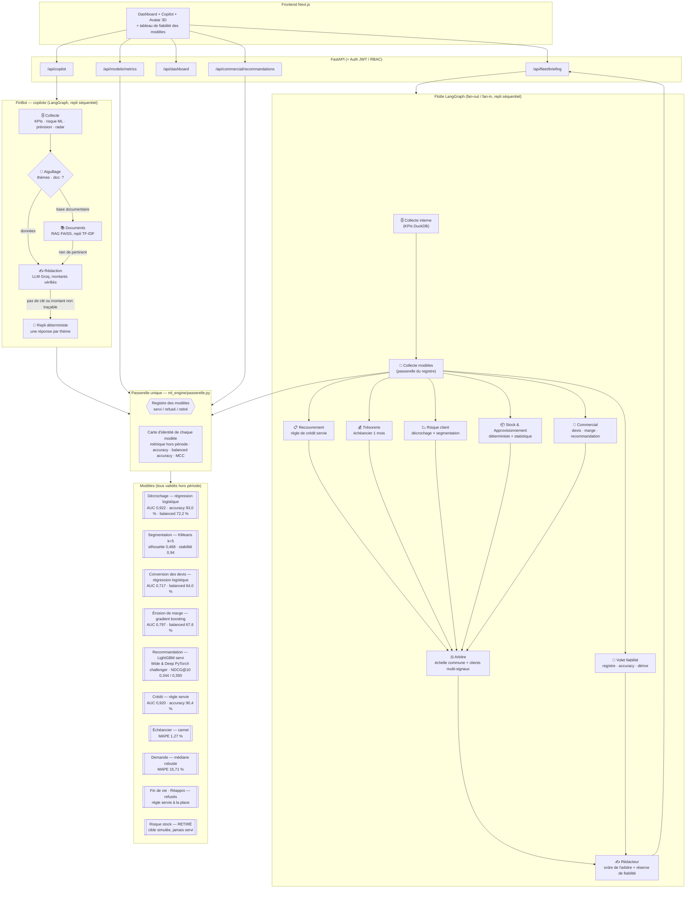
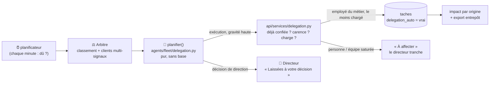

# Architecture de la flotte d'agents — schéma pour la soutenance

## Vue d'ensemble

## Qui consomme quel modèle

Cinq spécialistes, qui n'ont pas la même nature — et le schéma ne le cache pas :

| Nature | Agent | Ce qu'il consomme (via la passerelle) | Ce que cela apporte au constat |
|---|---|---|---|
| Modèles appris | 🤝 Commercial | Conversion des devis · Érosion de marge · Recommandation (LightGBM / Wide & Deep) | devis à relancer, marges à défendre, produits à proposer |
| Modèles appris | 📉 Risque client | Décrochage (logistique) × Segmentation (KMeans) | qui va partir, de quel type de clientèle, et quel segment perd le plus |
| Modèle servi | 💰 Trésorerie | Échéancier à 1 mois (carnet) | créances exigibles le mois prochain |
| Règle servie | 📋 Recouvrement | Conditions de crédit (la règle a battu le modèle appris) | distingue un client à conditions longues d'un défaut |
| Déterministe et statistique | 📦 Stock & Approvisionnement | Flux réels des factures · dépendance fournisseur · Demande (médiane mobile) · **Demande par référence** (médiane 12 mois servie après duel contre LightGBM). Réappro et fin de vie refusés, risque stock retiré | ruptures, argent immobilisé, dépendance fournisseur, **quantités à commander pour trois mois** |

Le **volet fiabilité** n'est pas un spécialiste : il lit le registre (tous les modèles,
`classification`, dérive PSI), écrit dans sa propre clé `fiabilite` et jamais dans
`findings`, contourne l'arbitre et rejoint le rédacteur par une jointure. Il ajoute une
réserve au briefing, sans jargon, quand une dérive est détectée. Le directeur le reçoit
dans l'API (`fiabilite`) ; un client, jamais.

Stock et Approvisionnement étaient deux agents : ils ont été réunis parce qu'ils servent la
même décision (commander ou écouler) et qu'aucun ne sert de modèle appris. Chaque volet garde
son constat, sa catégorie et son **domaine** — l'arbitre classe des constats, pas des agents —
et la panne d'un volet n'emporte pas l'autre.

Chaque constat porte `modeles_utilises` : libellé, nature, statut au registre, rôle,
et fiabilité mesurée. L'arbitre publie `modeles_mobilises`.

## Le copilote FinBot

Le copilote a la même forme que la flotte : un état (`EtatCopilote`), des
nœuds, un graphe LangGraph et un repli séquentiel qui rejoue exactement les
mêmes nœuds (`agents/copilote/`).

| Nœud | Rôle |
|---|---|
| `collecte` | chaîne d'outils du tableau de bord : intention, indicateurs, risque ML, prévision, anomalies, radar — c'est aussi, seule, la réponse de `/api/dashboard` |
| `aiguillage` | thèmes de la question ; base documentaire si elle commence par `doc:` ou ne relève d'aucun thème interne |
| `documents` | réponse tirée de la base documentaire (RAG) |
| `redaction` | réponse du modèle de langage, sur un contexte limité aux thèmes détectés ; écartée si elle cite un montant absent du contexte |
| `repli` | réponse déterministe du thème, au même format |

Les trois sources de réponse sont essayées dans cet ordre ; la première qui
répond termine le graphe, et `via` dit laquelle. Les modules sont séparés par
responsabilité : `intention.py` (routage), `outils.py`, `contexte.py`,
`prompt.py` (tous les prompts), `verification.py` (montants), `llm.py`,
`documents.py`, `repli.py`, `fichier.py` (fichier joint), `noeuds.py`,
`graph.py`.

Avant cette organisation, le copilote était un fichier unique de 1 544 lignes
(`agents/finance_agent.py`). La réorganisation a été vérifiée sur 128 réponses
— 21 questions, 3 périmètres, avec et sans modèle de langage (un modèle factice
enregistrait le prompt reçu) : textes et prompts identiques. Un seul
comportement a changé, volontairement : `via` valait « llm » dès qu'une clé
était configurée, même quand la réponse affichée venait des règles parce que
celle du modèle avait été écartée.

## Garanties d'ingénierie

| Garantie | Mécanisme | Test |
|---|---|---|
| Aucun agent ne fait planter le briefing | décorateur `_safe_node` (trace `erreur`, état partiel) | `test_safe_node_capture_les_exceptions`, injection de panne |
| Chaque modèle du registre a un consommateur réel | passerelle + `modeles_utilises` ; `hors_flotte` déclaré au registre (LayoutLMv3 → chaîne OCR) et vérifié | `test_chaque_modele_du_registre_atteint_un_agent` |
| La panne d'un volet n'emporte pas l'autre | isolation par volet dans `agent_stock_approvisionnement` | `test_briefing_survit_a_un_agent_en_panne` |
| Le domaine appartient au constat, pas à l'agent | `domaine` déclaré par constat, repli sur l'agent | `test_le_domaine_appartient_au_constat_pas_a_l_agent` |
| Le rédacteur s'exécute une seule fois, après l'arbitre ET le volet fiabilité | jointure `add_edge(["arbitre", "fiabilite_modeles"], "redacteur")` | `test_graphe_langgraph_joint_le_redacteur_une_seule_fois`, `test_repli_sequentiel_suit_le_meme_ordre` |
| Le briefing suit l'ordre de l'arbitre | `_ordre_de_lecture` | `test_redacteur_suit_l_ordre_de_l_arbitre` |
| Aucun agent n'importe un modèle directement | scan statique de `fleet/nodes.py` et de chaque module de `copilote/` | `test_aucun_agent_n_importe_un_modele_directement` |
| Un modèle refusé/retiré n'est jamais présenté comme servi | statut lu dans le registre | `test_un_modele_refuse_ou_retire_n_est_jamais_presente_comme_servi` |
| Confidentialité du périmètre client | `collecte_modeles` filtre par code ; stock, fournisseurs et registre non collectés | `test_collecte_modeles_filtre_les_autres_clients`, `test_perimetre_client_masque_stock_fournisseurs_et_registre` |
| Déterminisme en repli | briefing trié par sévérité sans LLM ; repli séquentiel sans LangGraph | `test_redacteur_deterministe_priorise_par_severite` |
| Contrat d'API stable | `run_briefing` → `{engine, briefing, findings, trace, fiabilite}` | `test_run_briefing_api_contract` |
| Le copilote dit d'où vient sa réponse | `via` = `rag`, `llm` ou `regles`, posé par le nœud qui a répondu | `test_via_dit_d_ou_vient_la_reponse` |
| Le copilote suit le même chemin avec ou sans LangGraph | `_run_sequential` rejoue les mêmes nœuds et décisions | `test_le_repli_sequentiel_suit_le_meme_chemin_que_le_graphe` |
| La flotte confie l'exécution, jamais la décision | `execution` déclaré par chaque constat ; `None` = décision de direction | `test_une_decision_de_direction_n_est_jamais_confiee_d_office`, `test_sur_la_vraie_flotte_chaque_constat_declare_qui_peut_l_executer` |
| Une alerte n'est jamais confiée deux fois, ni par la flotte ni par le directeur | même clé `origine_titre` que le bouton « Confier » | `test_la_flotte_ne_confie_jamais_deux_fois_la_meme_alerte` |
| Un seul passage planifié par jour | `delegations_auto.jour_planifie` unique | `test_un_seul_passage_planifie_par_jour` |

## Après le constat : la boucle d'action et la délégation autonome

Le constat devient ensuite une **tâche confiée** à un employé, dont le résultat
est mesuré puis rapatrié dans l'entrepôt (`ml_engine/boucle.py`) : les modèles
se confrontent enfin au terrain au lieu de prédire sans jamais savoir. Le
client, de son côté, agit depuis son espace, ce qui crée une tâche à affecter.

La tâche peut être confiée par le directeur (bouton « Confier ») ou **par la
flotte elle-même** : chaque constat déclare s'il relève de l'exécution (un
métier, un type d'action) ou de la direction (`execution: None`), et la
délégation autonome confie chaque jour le travail d'exécution à l'employé du
bon métier le moins chargé.

Voir `docs/BOUCLE_ACTION.md`, § « La délégation autonome ».
