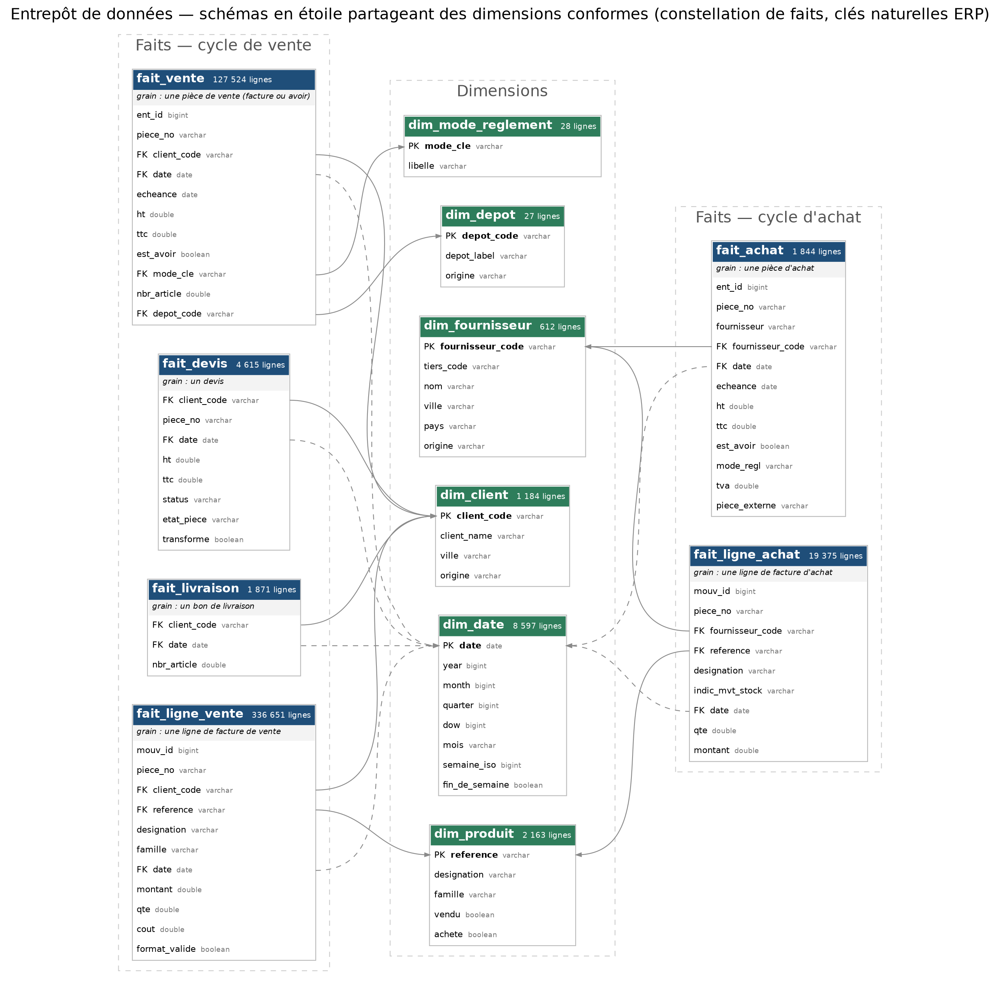

# Entrepôt de données — modèle en étoile (Kimball)

L'entrepôt (`output/analytics_store.duckdb`, DuckDB) est construit par un ETL
dédié, le paquet `etl/`, selon la méthode dimensionnelle de Kimball : des
**faits** au grain déclaré, des **dimensions conformes** partagées par tous les
faits, des **magasins de données** agrégés, et une **couche de présentation**
qui expose des noms stables à l'application.

```bash
python -m etl.construire             # reconstruit si une source a changé
python -m etl.construire --forcer    # reconstruit dans tous les cas
python -m etl.construire --verifier  # dit seulement si l'entrepôt est à jour
python scripts/schema_entrepot.py    # redessine le schéma à partir de l'entrepôt
```

La reconstruction est aussi automatique : avant de lire, le moteur
d'indicateurs compare la signature des CSV sources (taille, date, version du
modèle) à celle de la dernière construction, et relance l'ETL si elle a changé.



## Pourquoi cette organisation

Avant, un entrepôt existait déjà, mais sans modèle explicite :

* la construction était une fonction de 500 lignes **à l'intérieur du moteur
  d'indicateurs** (`kpi_engine.build_store`) — le même module écrivait et lisait
  l'entrepôt ;
* les tables mêlaient mesures et libellés (`sales.client_name`), sans grain
  déclaré ;
* `dim_client` ne couvrait pas les faits : **158 clients, 3,9 M DT de ventes**,
  n'y avaient aucune ligne ; `dim_date` ne contenait que les jours de vente et
  n'était lue par personne ; `dim_depot` n'était reliée à aucun fait ; le
  référentiel fournisseurs n'était pas chargé ;
* deux modules de stock relisaient eux-mêmes le CSV des lignes d'achat ;
* un **second entrepôt**, en pandas (`connectors/`, `ml_engine/preprocessing/`),
  servait de dernier repli à l'API avec d'autres règles — il comptait les avoirs
  comme des ventes ;
* les clients créés à l'import d'une facture scannée étaient **effacés à chaque
  reconstruction**, et le client suivant recevait à nouveau le code
  `OCR-0001`, déjà porté par des factures importées.

## Les couches

```
 CSV de l'ERP ──► staging ──► faits ──► dimensions ──► marts ──► présentation
 (etl/sources)   stg_*        fait_*    dim_*          mart_*    sales, purchases…
                 temporaires  règles    conformes      agrégats  vues : le contrat
                              métier    + membres                de l'application
                                        déduits
                                                     └──► contrôles (etl_controles)
```

| Couche | Module | Rôle |
|---|---|---|
| Sources | `etl/sources.py` | catalogue des 8 exports CSV — seul endroit du projet qui nomme un fichier source |
| Règles | `etl/regles.py` | dates, signe comptable, libellés de règlement, `NULL` littéral — écrites une fois |
| Staging | `etl/staging.py` | chaque source projetée et typée, **toutes lignes conservées**, tables temporaires |
| Faits | `etl/faits.py` | grain déclaré, signe, dédoublonnage, rejet des lignes décalées |
| Dimensions | `etl/dimensions.py` | dimensions conformes, membres déduits des faits |
| Marts | `etl/marts.py` | agrégats matérialisés relus par les écrans et les modèles |
| Présentation | `etl/presentation.py` | vues aux noms lus par l'application |
| Contrôles | `etl/qualite.py` | unicité, intégrité, calendrier, volumes — une erreur annule tout |
| Orchestration | `etl/construire.py` | l'ensemble dans **une transaction** |

La construction se fait **en place et dans une transaction** : si un contrôle
d'erreur échoue, rien n'est validé et l'entrepôt précédent reste servi. Les
tables écrites par l'application et les magasins dérivés des modules de stock
vivent dans le même fichier et ne sont jamais touchés (voir plus bas).

## Faits

| Fait | Grain (une ligne =) | Mesures | Clés de dimension |
|---|---|---|---|
| `fait_vente` | une pièce de vente — facture ou avoir — dédoublonnée | `ht`, `ttc` (signés), `nbr_article` | client, date, échéance, mode de règlement, dépôt |
| `fait_ligne_vente` | une ligne de facture de vente au format valide | `montant`, `qte`, `cout` (signés) | client, produit, date |
| `fait_achat` | une pièce d'achat dédoublonnée | `ht`, `ttc`, `tva` (signés) | fournisseur, date, échéance |
| `fait_ligne_achat` | une ligne de facture d'achat | `qte`, `montant` | fournisseur, produit, date |
| `fait_devis` | un devis dédoublonné | `ht`, `ttc` ; `transforme` (état ERP 8) | client, date |
| `fait_livraison` | un bon de livraison | `nbr_article` | client, date |

`rejet_ligne_vente` garde les lignes écartées pour décalage de colonnes : une
ligne illisible se voit dans un contrôle, elle ne disparaît pas.

Deux faits portent des **attributs dégénérés** — des libellés tels qu'ils
figurent sur la pièce : la désignation et la famille d'une ligne de vente
(208 références portent plusieurs désignations dans les factures, et les
analyses par désignation doivent voir celle de la facture), le nom du
fournisseur sur une pièce d'achat. Le libellé de référence est dans la
dimension.

## Dimensions

| Dimension | Clé | Source de référence | Membres déduits |
|---|---|---|---|
| `dim_client` | `client_code` | référentiel commercial GSL (979) | clients OCR (`ocr`), codes vus dans les faits seulement (`deduit`) |
| `dim_produit` | `reference` | lignes de vente et d'achat | — (construite depuis les faits) |
| `dim_fournisseur` | `fournisseur_code` | référentiel fournisseurs (609) | codes vus dans les achats seulement |
| `dim_depot` | `depot_code` | référentiel commercial GSL (21) | codes portés par les factures seulement |
| `dim_mode_reglement` | `mode_cle` | libellés des factures de vente | — |
| `dim_date` | `date` | calendrier continu | — |

**Clés.** Les dimensions utilisent les **clés naturelles** de l'ERP (code
client, référence, code fournisseur…) plutôt que des clés de substitution. Les
clés de substitution servent surtout à historiser les changements d'une
dimension (type 2) ou à fusionner des sources aux codes incompatibles ; ici, une
seule source, des codes stables, et aucun indicateur ne dépend de l'historique
d'un nom ou d'une ville. Les dimensions sont donc de **type 1** (écrasement au
dernier export), ce qui garde les requêtes simples et lisibles.

**Membres déduits.** Les dimensions sont construites *après* les faits : un
code présent dans un fait mais absent du référentiel devient un membre
`origine = 'deduit'`, libellé par son code — c'est déjà ainsi que l'application
l'affichait. Chaque fait trouve donc sa ligne de dimension, et les contrôles
d'intégrité le vérifient.

**Calendrier.** `dim_date` couvre sans trou le premier et le dernier jour
portés par un fait (dates de pièce et d'échéance, entre 2000 et 2035). Les dates
de remplissage de l'export (`1900-01-01`) ne l'étirent pas : elles sont
signalées par une alerte.

## Magasins de données (marts)

| Mart | Grain | Lu par |
|---|---|---|
| `mart_ventes_produit` | produit × année | tableau de bord, stock simulé |
| `mart_ventes_famille` | famille × année | tableau de bord, stock simulé |
| `mart_demande_client_produit` | client × produit (demande nette) | segmentation, stock simulé |
| `mart_marge_client_mois` | client × mois (coûts aberrants écartés) | tableau de bord, intégrité |
| `mart_qualite_marge` | une ligne : lignes écartées, retours, gratuités | tableau de bord |

## Couche de présentation

Le moteur d'indicateurs, les modèles, les agents et l'API lisent `sales`,
`sales_lines`, `purchases`… depuis le début du projet. Ces noms sont désormais
des **vues** : chacune recompose, à partir d'un fait et de ses dimensions,
exactement les colonnes attendues. Le modèle en étoile peut évoluer sans
qu'aucun lecteur ne change, tant que ces vues gardent leur contrat — un test le
vérifie colonne par colonne.

| Vue | Construite sur |
|---|---|
| `sales` | `fait_vente` + `dim_client` (nom) + `dim_mode_reglement` (libellé) ; année et délai calculés |
| `sales_lines`, `sales_lines_rejetees` | `fait_ligne_vente`, `rejet_ligne_vente` |
| `purchases` | `fait_achat` ; année et délai calculés |
| `devis`, `bl` | `fait_devis`, `fait_livraison` |
| `product_sales`, `product_family`, `client_product_demand`, `client_margin`, `margin_quality` | les marts correspondants |

## Règles de nettoyage

| Règle | Défaut mesuré dans l'export | Où |
|---|---|---|
| Signe comptable | `HT_DEV`/`TTC_DEV` toujours positifs, y compris sur un avoir : 5 761 avoirs comptés deux fois, 14,8 M DT | `regles.signe`, faits |
| Dédoublonnage des pièces | `ENT_ID` unique par construction ; 1 324 factures présentes deux fois (même numéro, client, date, montant), 1,05 M DT | faits |
| Dédoublonnage ciblé des lignes | seules les lignes des en-têtes dupliqués sont dédoublonnées ; une facture peut porter deux lots identiques | `fait_ligne_vente` |
| Lignes décalées | `SENS` = « CULTURE », « GAFSA » : une virgule non échappée a décalé la ligne | `rejet_ligne_vente` |
| Coûts aberrants | coûts de revient à plus de 5 fois le prix de vente (erreurs de saisie) | `mart_marge_client_mois` |
| Dates | format américain non complété (`1/7/2024`), deux replis ; échéances hors 2000-2035 ignorées | `regles.date` |
| Modes de règlement | casse, espaces, `90JOURS`, `NULL` : 28 groupes normalisés | `dim_mode_reglement` |

## Contrôles

À la fin de chaque construction (`etl_controles`, `reports/etl_construction.json`) :

* **erreur** — clé de dimension en double, fait orphelin de sa dimension, fait
  vide : la construction est annulée ;
* **alerte** — donnée source imparfaite, entrepôt juste : dates hors
  calendrier (4), lignes de vente sans référence produit (192), lignes rejetées (2) ;
* **info** — ce que les règles ont fait : doublons écartés, avoirs, chiffre
  d'affaires net, clients déduits.

La table `etl_execution` garde la signature, la version du modèle, la date et
la durée de la dernière construction (≈ 6 s, contre 13 s auparavant : chaque
CSV n'est plus lu qu'une fois).

## Ce que l'ETL ne construit pas

Le fichier de l'entrepôt contient aussi des tables que l'ETL ne touche jamais :

| Tables | Écrites par | Pourquoi dans l'entrepôt |
|---|---|---|
| `factures_importees`, vues `sales_augmentee`, `purchases_augmentee` | l'import OCR (`ml_engine/ocr/importer.py`) | ventes et achats hors ERP, à côté des ventes ERP sans s'y confondre |
| `retours_taches`, `retours_clients` | la boucle d'action (`ml_engine/boucle.py`) | résultats des tâches, renvoyés vers les modèles |
| `stock_flux_reel`, `achats_lignes`, `achats_mensuels`, `ventes_mensuelles`, `stock_position_mensuelle`, `mix_clientele_mensuel` | les modules de stock (`ml_engine/stock/`, lancés par `ml_engine/synchro.py`) | magasins dérivés, portant des décisions d'analyse (valeur de l'indicateur de mouvement de stock, classement des prestations) qui appartiennent à ces modules |

Les clients créés par l'import OCR sont réintégrés dans `dim_client` à chaque
construction (`origine = 'ocr'`).

## Ce qui lit encore les CSV

Seul l'ETL lit les sources pour construire l'entrepôt. Trois modules
d'apprentissage construisent encore **leur jeu d'entraînement** sur la source
brute, avec des colonnes que l'entrepôt ne charge pas (commercial,
établissement, code tarif pour le crédit) ou leurs propres règles (quantité
facturée pour l'ancienne prévision de demande) :

* `ml_engine/analytics/churn_model.py` (décrochage),
* `ml_engine/analytics/credit_risk_model.py` (conditions de crédit),
* `ml_engine/models/demand_features.py` (ancienne prévision de demande, chemin de repli).

Leur chemin vient désormais du catalogue (`etl/sources.py`). Les rebrancher sur
l'entrepôt changerait leurs données d'apprentissage : il faudrait les
réentraîner et refaire leur évaluation, ce qui sort du cadre d'une
réorganisation qui ne doit rien changer aux résultats. Les scripts d'audit et le
test de sémantique des colonnes ERP lisent aussi la source, volontairement :
ils vérifient ce que contiennent les colonnes brutes.

## Vérification de la réorganisation

L'ancien et le nouvel entrepôt ont été construits à partir des mêmes CSV, puis
comparés objet par objet (colonnes, puis contenu trié ligne à ligne) :

| Objets | Résultat |
|---|---|
| `sales`, `sales_lines`, `sales_lines_rejetees`, `purchases`, `devis`, `bl` | identiques (127 524, 336 651, 2, 1 844, 4 615, 1 871 lignes) |
| les 5 agrégats | identiques, à la précision des sommes flottantes près ¹ |
| `stock_flux_reel`, `achats_lignes`, `achats_mensuels`, `ventes_mensuelles`, `stock_position_mensuelle` (reconstruits sur `fait_ligne_achat`) | identiques ¹ ² |
| `dim_client` | les 979 lignes d'avant, inchangées, + 205 membres déduits |
| `dim_depot`, `dim_date` | lignes d'avant inchangées ; 6 dépôts déduits ; calendrier complété |

¹ DuckDB additionne en parallèle : deux constructions du **même** code
diffèrent déjà au 10⁻⁷ près sur une somme. La comparaison tolère 10⁻⁹ en relatif.
² Hors libellé `produit`, tiré au hasard entre variantes de casse
(`any_value`) — c'était déjà le cas d'une exécution à l'autre avant la refonte.

La suite de tests compte 21 tests de l'entrepôt (`tests/test_entrepot.py`) :
contrat des vues, règles métier, intégrité, calendrier, préservation des tables
applicatives et des clients OCR, annulation d'une construction dont un contrôle
échoue, migration d'un entrepôt construit avant la refonte.
