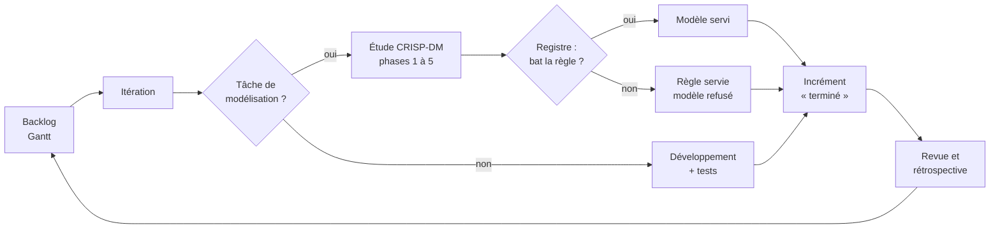

# Méthodologie de travail

Le projet a été conduit à deux niveaux, avec une méthode pour chacun :

| Niveau | Question | Méthode |
|---|---|---|
| **Conduite du projet** | dans quel ordre construire la plateforme, et quand la montrer ? | démarche **itérative et incrémentale, inspirée de Scrum** |
| **Chaque modèle de données** | ce modèle mérite-t-il d'être servi ? | **CRISP-DM**, avec un critère de succès fixé avant la modélisation |

Le planning réel est dans le diagramme de Gantt
[`docs/Gantt_PFE_Overlyne_27avril-27octobre_2026.xlsx`](Gantt_PFE_Overlyne_27avril-27octobre_2026.xlsx) :
du 27 avril au 27 octobre 2026, **7 phases, 34 tâches, 4 jalons**. Ce document
renvoie aux numéros de tâches du Gantt (1.1, 3.4, J2…).

---

## 1. Pourquoi une démarche itérative plutôt qu'un cycle en cascade

Un cycle en cascade suppose un besoin figé et des données connues dès le
départ. Aucun des deux n'était vrai ici :

- **Le besoin s'est précisé en construisant.** « Aide à la décision » est
  devenu, au fil des itérations : un briefing de direction classé par un
  arbitre (4.2), puis une boucle qui transforme une alerte en tâche confiée et
  en mesure le résultat (5.5), enfin une flotte qui confie elle-même le
  travail d'exécution et laisse les décisions au directeur (5.8).
- **Les données ont réservé des surprises.** Le dictionnaire des données (1.4)
  a révélé l'absence de dates de règlement dans l'ERP, ce qui a changé la façon
  de calculer le recouvrement (`docs/DONNEES_MANQUANTES.md`).
- **Un modèle peut être refusé après évaluation.** Le plan ne pouvait pas
  promettre qu'un modèle serait servi. Il fallait un moyen de livrer quand même
  une plateforme qui fonctionne : c'est le rôle de la règle de repli.
- **Certaines pistes ont été abandonnées.** La veille des appels d'offres
  (4.4) est restée à l'état de prototype puis a été retirée. La flotte est
  passée de 7 à 5 agents (4.6). Un modèle de risque de stock a été retiré parce
  que sa cible était simulée.

Une démarche itérative absorbe ces changements. Chaque itération part de ce
que la précédente a appris.

## 2. Ce qui est emprunté à Scrum, et ce qui ne l'est pas

Le stage a été réalisé par **une seule personne**. Scrum est conçu pour une
équipe : il a donc été **adapté**, pas appliqué à la lettre.

| Élément de Scrum | Application dans le projet | Où le vérifier |
|---|---|---|
| Backlog produit | cahier des charges et PRD (1.3), puis la liste des tâches du Gantt | Gantt, tâche 1.3 |
| Itération (*sprint*) | périodes de 2 à 8 semaines, chacune centrée sur un incrément | § 3 ci-dessous |
| Incrément livrable | à la fin de chaque itération, la plateforme **tourne** : rien n'est livré « à moitié branché » | jalons J1 à J3 |
| Définition de « terminé » | code + tests verts + documentation à jour + métriques publiées pour un modèle | § 5 ci-dessous |
| Revue d'itération | démonstration de l'incrément à l'encadrant | *à compléter : fréquence réelle des points avec l'encadrant de l'entreprise et celui de l'école* |
| Rétrospective | chaque défaut de méthode constaté a donné lieu à une refonte explicite | tâches 3.4, 4.6, 7.2 |

**Non repris**, faute d'équipe : les rôles distincts (Product Owner, Scrum
Master, développeurs), la mêlée quotidienne, l'estimation en points et la
vélocité. Les itérations ne sont pas de durée fixe : elles suivent la taille
de l'incrément visé. C'est la raison du mot « inspirée ».

**Deux rétrospectives ont changé le projet :**

- **Refonte data science (3.4).** Tous les modèles ont été réévalués sur des
  mois **postérieurs** à leur entraînement, et comparés à une règle simple.
  Certains ont été refusés : c'est un résultat, pas un échec.
- **Refonte d'architecture (7.2).** L'API mélangeait HTTP et logique métier,
  deux entrepôts de données coexistaient, et le copilote tenait dans un seul
  fichier de 1 544 lignes. La refonte a séparé l'API en couches, reconstruit
  l'entrepôt selon Kimball et découpé le copilote en graphe LangGraph. Pour
  chacune, le comportement a été **comparé avant et après**, sur les mêmes
  entrées (`docs/ARCHITECTURE_API.md`, `docs/DATA_WAREHOUSE.md`,
  `docs/ARCHITECTURE_AGENTS.md`).

## 3. Les incréments, reliés au Gantt

Les tâches du Gantt se chevauchent : une itération en recouvre parfois une
autre. Le tableau regroupe les tâches par **incrément livré**. Les tests
(7.1) ne forment pas un incrément : ils ont été écrits en continu, du 13/07 au
29/09, avec chaque fonction.

| Incrément | Période | Tâches du Gantt | Ce qui tournait à la fin | Jalon |
|---|---|---|---|---|
| **1. Cadrage et fondations** | 27/04 → 12/06 | 1.1 à 1.4, 2.1, 2.2, 3.1, 4.1 | dictionnaire des données, entrepôt en étoile, premiers modèles, premier graphe d'agents | **J1** — premier dépôt (03/06) |
| **2. Plateforme intégrée** | 08/06 → 29/07 | 2.3, 3.2, 3.3, 4.2, 4.3, 4.4, 5.1 | KPI, modèles clients et ventes, flotte d'agents, copilote et RAG, tableau de bord | **J2** — plateforme intégrée (29/07) |
| **3. Plateforme multi-comptes** | 20/07 → 12/09 | 5.2, 5.3, 5.4, 5.6, 5.7 | comptes et rôles, isolation des clients, simulation d'encaissement, Docker et intégration continue | — |
| **4. Fiabilisation et boucle d'action** | 01/09 → 22/09 | 3.4, 3.5, 3.6, 4.5, 4.6, 5.5, 6.1, 6.2 | évaluation hors période, registre des modèles, explicabilité, boucle d'action, lecture des factures | **J3** — LayoutLMv3 intégré (21/09) |
| **5. Consolidation** | 13/09 → 29/09 | 3.7, 5.8, 7.2 | demande par référence, architecture en couches, délégation autonome de la flotte, documentation | — |
| **Clôture** | 21/09 → 27/10 | 7.3, 7.4 | rapport de PFE, soutenance | **J4** — fin du stage (27/10) |

Chaque ligne du Gantt indique d'où vient sa date (colonne *Source*) :
11 tâches sont datées par un commit git, 7 par des fichiers datés, 8 par des
travaux de session datés, 1 est prévue, et **7 sont des estimations à
confirmer** (1.1, 1.2, 2.3, 3.2, 5.3, 5.4, 5.6). Le dépôt git n'a pas été
alimenté à chaque itération : les dates des fichiers complètent l'historique.

## 4. CRISP-DM : la méthode de chaque modèle

Chaque modèle suit les six phases de CRISP-DM. Deux études sont documentées
phase par phase :
[`CRISP_DM_STOCK.md`](CRISP_DM_STOCK.md) et
[`CRISP_DM_DEMANDE_REFERENCE.md`](CRISP_DM_DEMANDE_REFERENCE.md). Les autres
modèles sont décrits dans `reports/METRICS_REPORT.md`.

| Phase | Règle suivie dans le projet |
|---|---|
| 1. Compréhension du métier | le besoin est traduit en une décision à éclairer, et le **critère de succès est fixé avant de modéliser** (métrique, règle de référence, écart minimal) |
| 2. Compréhension des données | exploration et contrôle de qualité : `notebooks/02_data_understanding.ipynb`, dictionnaire `docs/data_pfe_data_dictionary.xlsx` |
| 3. Préparation | données lues dans l'entrepôt ; découpage **temporel**, jamais aléatoire : aucune information du futur n'entre dans l'apprentissage |
| 4. Modélisation | toujours comparée à une **règle simple** (médiane, naïf saisonnier, règle métier) |
| 5. Évaluation | réglages choisis sur la période de validation ; la période de test n'est **lue qu'une fois**, pour le verdict |
| 6. Déploiement | le **registre** (`ml_engine/registre.py`) décide : servi, refusé (la règle est servie à la place) ou retiré ; les agents passent par la passerelle (`ml_engine/passerelle.py`) et ne voient que ce qui est servi |

Le registre rend la phase 5 **contraignante** : un modèle qui ne bat pas sa
règle n'est pas servi, même s'il est déjà entraîné. Trois exemples :

- **Demande par référence (3.7)** : 31 méthodes comparées. LightGBM gagnait
  en validation mais perd 1,57 point de WAPE au test. La médiane sur 12 mois
  est donc servie.
- **Réapprovisionnement** : AUC 0,930 hors période, mais la règle de
  référence atteint déjà 0,916. Le gain (+0,014) reste sous le seuil de 0,02
  déclaré avant la mesure : le modèle est refusé et la règle est servie.
- **Risque de stock** : retiré, parce que sa cible reposait sur des données
  simulées.

CRISP-DM est lui-même itératif : l'évaluation peut renvoyer à la
compréhension du métier. C'est ce qui s'est passé pour la demande par
référence. La « phase 5 bis » a diagnostiqué l'écart entre validation et test
avant de conclure.

## 5. Comment les deux méthodes s'articulent

Une étude CRISP-DM se déroule **à l'intérieur** d'une itération. Sa phase 6
(déploiement) fait partie de l'incrément. Si le modèle est refusé, l'incrément
livre la règle : la plateforme fonctionne dans les deux cas, et le refus est
affiché comme tel (`docs/ARCHITECTURE_AGENTS.md`).

Un incrément est « terminé » quand :

1. **il tourne** : l'API et l'interface démarrent, la fonction est accessible ;
2. **les tests passent** : 666 tests aujourd'hui, dont 22 tests « vitrine »
   rejouables devant un jury (`python -m pytest -m vitrine -v`, détail dans
   `docs/TESTS.md`). L'intégration continue les relance à chaque envoi sur
   GitHub (`.github/workflows/ci.yml`) ;
3. **la documentation est à jour** : les tableaux de métriques et de tests sont
   **générés** (`scripts/tableau_metriques.py`, `scripts/tableau_tests.py`),
   jamais recopiés ;
4. **pour un modèle** : ses métriques hors période sont publiées dans
   `reports/` et le registre a statué ;
5. **pour une refonte** : le comportement est comparé avant et après sur les
   mêmes entrées, et tout écart est expliqué.

## 6. Limites

- **Une seule personne.** Il n'y a pas eu de relecture croisée du code. Les
  tests et les comparaisons avant/après en tiennent lieu en partie seulement.
- **Itérations de durée variable.** La démarche est inspirée de Scrum, sans en
  avoir la cadence fixe.
- **Gantt en partie reconstitué.** Sept tâches ont des dates estimées. Elles
  sont signalées comme telles dans la colonne *Source*.

---

## Ce qu'il faut retenir pour le mémoire

> « Le projet a suivi une démarche **itérative et incrémentale inspirée de
> Scrum**, adaptée à un stagiaire seul : cinq incréments, chacun livrant une
> plateforme qui fonctionne, reliés aux jalons du Gantt. Chaque modèle a suivi
> **CRISP-DM**, avec un critère de succès fixé avant la modélisation et une
> période de test lue une seule fois. Un registre rend le verdict
> contraignant : un modèle qui ne bat pas sa règle simple n'est pas servi. »
