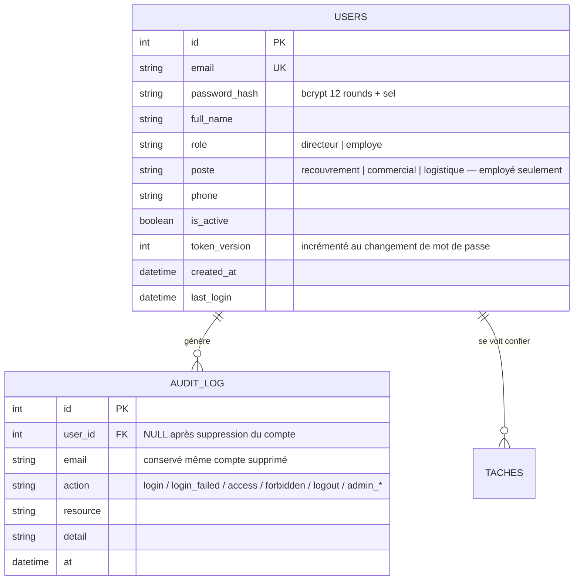

# Sécurité, authentification & multi-comptes — documentation

## 1. Architecture

Deux bases séparées, par conception :

| Base | Rôle | Techno |
|---|---|---|
| **Base d'authentification** | identités, rôles, audit | PostgreSQL **uniquement**, via SQLAlchemy — `AUTH_DATABASE_URL` obligatoire, aucun repli |
| **Entrepôt analytique** | données métier ERP (71 KPIs) | DuckDB (`output/analytics_store.duckdb`) |

## 2. Schéma de la base d'authentification



### Deux rôles, et pourquoi pas trois

`ROLES = (directeur, employe)` dans `api/auth/models.py` : **le directeur décide,
l'employé exécute ce qu'on lui confie.** Il n'y a pas de troisième rôle.

Un rôle `client` — un portail où chaque établissement aurait consulté ses propres
données — a existé puis a été **retiré**, pour deux raisons qui ne sont pas
techniques :

1. Les acheteurs d'Overlyne sont des **hôpitaux publics**. Ils passent par des
   marchés et des bons de commande, pas par le portail web d'un fournisseur.
   Le rôle répondait à un besoin que personne n'avait exprimé.
2. L'écran exposait au client **des analyses internes qui le concernaient** :
   sa probabilité de décrochage, la marge réalisée sur lui, les produits qu'on
   envisageait de lui proposer. Montrer à un client la marge qu'on fait sur lui
   est une faute commerciale, et la cloisonner correctement aurait coûté plus
   que de retirer l'écran.

Le retrait est **effectif à trois niveaux**, pas seulement dans l'interface :

| Niveau | Garantie |
|---|---|
| Connexion | un compte dont le rôle n'est pas dans `ROLES` est refusé par un **401 neutre**, identique à un mauvais mot de passe |
| Affichage | `GET /api/admin/users` ne liste que les rôles en vigueur (`inclure_retires=true` pour inspecter) |
| Base | `POST /api/admin/purger-roles-retires` efface définitivement ces comptes, journal d'audit conservé |

Quatre tests le prouvent dans `tests/test_auth_rbac.py` :
`test_un_compte_d_un_role_retire_ne_se_connecte_plus`,
`test_un_compte_d_un_role_retire_n_est_pas_liste`,
`test_la_purge_efface_les_roles_retires_sans_toucher_a_l_equipe`,
`test_la_purge_est_reservee_au_directeur`.

Le reste du schéma — `taches`, `evenements_tache`, `commandes_fournisseur`,
`evenements_commande`, `delegations_auto`, `reglages` — porte la boucle d'action
et la délégation autonome (voir `docs/BOUCLE_ACTION.md`). `revoked_tokens` et
`login_attempts` portent la révocation et l'anti-brute-force.

## 3. Authentification

- **Hachage** : bcrypt 12 rounds avec sel intégré (librairie `bcrypt` directe) — jamais en clair, jamais réversible.
- **Secret de signature** : `JWT_SECRET_KEY` est **exigé au démarrage** (`verifier_secret()` dans le `lifespan`, à côté du contrôle PostgreSQL) et refusé en dessous de **32 octets** — minimum imposé par la RFC 7518 §3.2 pour HS256, en dessous duquel la résistance de la signature tombe à la taille de la clé. **Aucun secret n'est généré à la volée** : un secret tiré au démarrage diffère d'un worker à l'autre, donc un jeton émis par l'un est rejeté par les autres (401 intermittents et sans message), et chaque redémarrage invalide les sessions. Les tests posent leur propre clé et ne signent jamais avec celle de production.
- **Sessions** : JWT signés HS256 (`JWT_SECRET_KEY`), expiration configurable (défaut 8 h). Transport **double** : cookie **httpOnly SameSite=Lax** pour le navigateur (le JS ne peut pas lire le jeton → immunisé contre le vol par XSS ; Lax bloque l'envoi depuis un site tiers → protection CSRF) **et** `Authorization: Bearer` pour les clients API/tests. `COOKIE_SECURE=1` en production HTTPS.
- **Révocation** — deux mécanismes vérifiés à CHAQUE requête :
  - *unitaire* : chaque JWT porte un `jti` unique ; le logout l'inscrit dans la table `revoked_tokens` → le jeton meurt immédiatement, même copié ;
  - *globale* : chaque compte porte une `token_version` embarquée dans le JWT (`ver`) ; un changement de mot de passe l'incrémente → toutes les sessions antérieures tombent. Les entrées expirées sont purgées à chaque login.
- **Politique de mot de passe** : ≥ 10 caractères, majuscule + minuscule + chiffre (vérifiée au seed/création/reset).
- **Anti-brute-force PERSISTANT** : 5 échecs / 5 min par email **et** par IP → HTTP 429, compteur stocké dans la table `login_attempts` (survit aux redémarrages, correct en multi-instances ; repli mémoire si la base est indisponible).
- **Réponses neutres** : email inconnu et mot de passe faux renvoient le même 401 (pas de divulgation d'existence de compte).
- **Audit** : `login`, `login_failed`, `login_rate_limited`, `access`, `forbidden`, `logout` journalisés dans `audit_log` ; côté boucle d'action, `tache_create`, `tache_update`, `delegation_reglage` (qui a activé ou coupé la délégation autonome) et `delegation_auto` (chaque passage, signé « flotte d'agents » quand aucun humain ne l'a lancé).

## 4. RBAC (côté serveur)

Deux dépendances FastAPI portent toute la décision, et elles sont déclarées
**au niveau du routeur** — un oubli sur une route n'ouvre donc rien :

| Dépendance | Qui passe | Où elle s'applique |
|---|---|---|
| `require_directeur` | directeur seul | toutes les routes analytiques et d'administration |
| `require_interne` | directeur **ou** employé | les tâches, et elles seules |

| Endpoint | directeur | employé |
|---|---|---|
| `POST /api/dashboard`, `/api/ai_insight`, `/api/copilot`, `/api/fleet/briefing` | vue globale ou filtrée | **403** |
| `GET /api/commercial/devis`, `/marge`, `/recommandations`, `/ca-client` | oui | **403** |
| `GET /api/churn`, `/api/stock`, `/api/supply`, `/api/impact` | oui | **403** |
| `POST /api/forecast` (trésorerie société) | oui | **403** |
| `GET /api/models/metrics`, `/api/ocr/*` | oui | **403** |
| `GET /api/taches`, `/api/taches/impact` | toutes les tâches | **ses tâches uniquement** |
| `POST /api/taches` (confier), `PATCH assigne_id` | oui | **403** |
| `GET\|PUT /api/taches/delegation`, `POST /api/taches/delegation/lancer` | oui | **403** |
| `GET\|PATCH /api/taches/{id}` d'un collègue | oui | **404** (ne confirme pas l'existence) |
| `/api/admin/*` (comptes, audit, purge) | oui | **403** |
| `GET /api/health` | public | public |

Un compte `employe` n'a **aucun périmètre de données** : il n'obtient pas une vue
vide qu'un oubli d'interface pourrait remplir, il obtient un 403. Son écran est
réduit aux tâches qui lui sont confiées. Le 404 sur la tâche d'un collègue est
volontaire : un 403 confirmerait que la tâche existe.

Le service `api/services/perimetre.py` et la route `POST /api/portal/actions`,
que décrivait une version antérieure de ce document, **ont été supprimés avec le
rôle client** : il n'y a plus de périmètre à forcer, puisqu'aucun compte externe
ne se connecte.

**Preuves par les tests** (`tests/test_auth_rbac.py`, `tests/test_admin_portal.py`,
`tests/test_boucle_action.py`, `tests/test_delegation.py`) : 401 sans jeton sur
tous les endpoints, 429 en brute-force, 403 de l'employé sur quatorze routes
analytiques énumérées une par une, 404 sur la tâche d'un collègue, rôle retiré
refusé à la connexion, journal alimenté.

## 4 bis. Gestion des comptes par le directeur (CRUD)

Onglet **Administration** → `/api/admin/*`, routeur entier sous
`require_directeur` (403 sinon), chaque opération auditée.

| Opération | Endpoint | Règles appliquées |
|---|---|---|
| Lister | `GET /users` | **rôles en vigueur seulement** ; `?inclure_retires=true` pour inspecter |
| Dénombrer les rôles retirés | `GET /roles-retires` | combien de comptes d'un rôle supprimé subsistent en base |
| Créer | `POST /users` | rôle dans `ROLES` (sinon 422) · email unique (409) · politique de mot de passe · `poste` conservé pour un employé seulement |
| Modifier | `PATCH /users/{id}` | nom, identifiant de connexion (409 si pris), métier, téléphone, activation, mot de passe (→ révoque les sessions) |
| Désactiver | `DELETE /users/{id}` | *soft delete* (défaut, **réversible**) : le compte reste en base, connexion refusée, réactivation possible |
| Supprimer définitivement | `DELETE /users/{id}?permanent=true` | *hard delete* **irréversible** : la ligne `users` est physiquement supprimée |
| Purger les rôles retirés | `POST /purger-roles-retires` | efface **en une fois** tous les comptes dont le rôle n'est plus dans `ROLES` |

**Suppression définitive — traitement des dépendances** (le point qu'un jury
vérifie). Un seul helper, `_detacher_et_effacer`, le fait pour la suppression
unitaire **comme** pour la purge : il n'y a pas deux chemins qui pourraient
diverger.

| Table liée | Traitement | Justification |
|---|---|---|
| `audit_log` | **conservé, anonymisé** (`user_id` → NULL, email gardé) | un journal d'audit ne s'efface pas : effacer un compte ne doit pas effacer la preuve de ce qu'il a fait |
| `taches` encore ouvertes | repassent à `a_affecter`, `assigne_id` détaché | une tâche à faire ne disparaît pas avec celui à qui elle était confiée |
| `evenements_tache` | `user_id` détaché | l'historique de la tâche reste lisible |
| `revoked_tokens` | supprimés | sans objet une fois le compte parti |

Garde-fous serveur : impossible de supprimer **son propre compte**, ni le
**dernier directeur actif** (422 dans les deux cas). La purge, elle, ne peut
emporter aucun compte de rôle en vigueur — sa clause porte sur
`role NOT IN ROLES`, et un test le vérifie explicitement. Côté interface, la
suppression unitaire exige la **saisie exacte de l'identifiant**, et la purge une
confirmation qui annonce le nombre de comptes et ce qu'il advient du journal.

Couvert par `test_suppression_definitive_retire_le_compte_de_la_base`,
`test_suppression_definitive_conserve_le_journal_daudit`,
`test_impossible_de_supprimer_le_dernier_directeur`,
`test_le_role_client_ne_peut_plus_etre_cree`,
`test_les_routes_du_portail_client_n_existent_plus`,
`test_la_purge_efface_les_roles_retires_sans_toucher_a_l_equipe`.

## 5. Installation & déploiement

```bash
# 1. Dépendances
pip install -r requirements.txt

# 2. Configuration (jamais committée)
cp .env.example .env      # renseigner JWT_SECRET_KEY, AUTH_DATABASE_URL…

# 3. Base PostgreSQL (production)
createdb finance_auth     # ou : docker run -e POSTGRES_DB=finance_auth -e POSTGRES_USER=finance -e POSTGRES_PASSWORD=*** -p 5432:5432 postgres:16
# AUTH_DATABASE_URL est OBLIGATOIRE : sans elle, ou avec l'URL d'un autre
# moteur, l'API refuse de démarrer.

# 4. Schéma + comptes de l'équipe
python -m api.auth.seed
#   directeur@overlyne.tn      / Directeur#2026
#   recouvrement@overlyne.tn   / Employe#2026
#   commercial@overlyne.tn     / Employe#2026
#   logistique@overlyne.tn     / Employe#2026
# Le seed DÉSACTIVE au passage tout compte dont le rôle n'est plus servi.
# Pour les effacer de la base : onglet Administration → « Purger », ou
# POST /api/admin/purger-roles-retires.

# 5. Lancement
python api/main.py                 # API sur :9000
cd frontend && npm install && npm run dev   # UI sur :4000
```

## 6. Frontend

Écran `/login`, garde d'authentification sur le dashboard, badge de rôle et
déconnexion dans la barre de navigation, gestion des 401 (purge de session →
`/login`) et des 403 (message explicite plutôt qu'un écran vide).

Deux vues, pour les deux rôles : le directeur voit les onglets d'analyse ;
l'employé ne voit que ses tâches confiées. L'onglet Administration signale, le
cas échéant, les comptes d'un rôle retiré restés en base et propose de les
purger.

**L'UI n'est qu'un confort : toutes les garanties sont côté serveur.** Un
employé qui forcerait l'affichage d'un onglet d'analyse obtiendrait un 403 de
l'API, pas des données.

## 7. Limites résiduelles (honnêteté)

Les trois faiblesses historiques (pas de révocation, rate limiting en mémoire, jeton en localStorage) sont **résolues** : denylist `jti` + `token_version`, table `login_attempts`, cookie httpOnly SameSite=Lax — chacune couverte par un test dédié (`test_logout_revoque_le_jeton_immediatement`, `test_changement_de_mot_de_passe_revoque_les_sessions`, `test_rate_limiting_est_persistant_en_base`, `test_login_pose_un_cookie_httponly`). Restent, en toute transparence :

- La vérification de révocation ajoute une requête BDD par appel authentifié (indexée sur `jti` — négligeable à cette échelle ; un cache Redis serait l'optimisation suivante).
- SameSite=Lax protège du CSRF pour les navigateurs modernes ; une défense en profondeur (double-submit token) serait l'étape d'après pour une exposition Internet publique.
- En développement, front et API doivent partager le même hôte (`localhost:4000` → `localhost:9000`) pour que le cookie same-site soit porté — c'est la configuration par défaut livrée.
