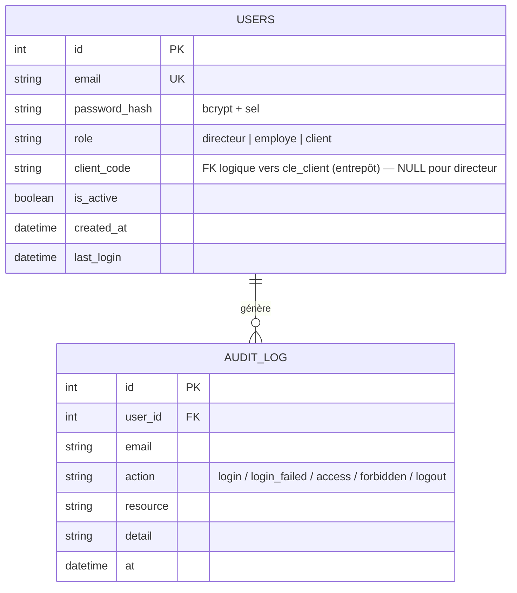

# Sécurité, authentification & multi-comptes — documentation

## 1. Architecture

Deux bases séparées, par conception :

| Base | Rôle | Techno |
|---|---|---|
| **Base d'authentification** | identités, rôles, audit | PostgreSQL (prod) / SQLite (démo) via SQLAlchemy — `AUTH_DATABASE_URL` |
| **Entrepôt analytique** | données métier ERP (71 KPIs) | DuckDB (`output/analytics_store.duckdb`) |

## 2. Schéma de la base d'authentification



Chaque compte `client` est relié **1-à-1** à un `client_code` réel de l'entrepôt (ex. `CE000016`). Le rôle est porté par `users.role` (RBAC à 3 rôles, extensible).

Trois tables complètent ce schéma pour la boucle d'action (`taches`,
`evenements_tache`, et `client_requests` étendue) — voir `docs/BOUCLE_ACTION.md`.

## 3. Authentification

- **Hachage** : bcrypt 12 rounds avec sel intégré (librairie `bcrypt` directe) — jamais en clair, jamais réversible.
- **Sessions** : JWT signés HS256 (`JWT_SECRET_KEY`), expiration configurable (défaut 8 h). Transport **double** : cookie **httpOnly SameSite=Lax** pour le navigateur (le JS ne peut pas lire le jeton → immunisé contre le vol par XSS ; Lax bloque l'envoi depuis un site tiers → protection CSRF) **et** `Authorization: Bearer` pour les clients API/tests. `COOKIE_SECURE=1` en production HTTPS.
- **Révocation** — deux mécanismes vérifiés à CHAQUE requête :
  - *unitaire* : chaque JWT porte un `jti` unique ; le logout l'inscrit dans la table `revoked_tokens` → le jeton meurt immédiatement, même copié ;
  - *globale* : chaque compte porte une `token_version` embarquée dans le JWT (`ver`) ; un changement de mot de passe l'incrémente → toutes les sessions antérieures tombent. Les entrées expirées sont purgées à chaque login.
- **Politique de mot de passe** : ≥ 10 caractères, majuscule + minuscule + chiffre (vérifiée au seed/création/reset).
- **Anti-brute-force PERSISTANT** : 5 échecs / 5 min par email **et** par IP → HTTP 429, compteur stocké dans la table `login_attempts` (survit aux redémarrages, correct en multi-instances ; repli mémoire si la base est indisponible).
- **Réponses neutres** : email inconnu et mot de passe faux renvoient le même 401 (pas de divulgation d'existence de compte).
- **Audit** : `login`, `login_failed`, `login_rate_limited`, `access`, `forbidden`, `logout` journalisés dans `audit_log`.

## 4. RBAC & isolation stricte (côté serveur)

| Endpoint | directeur | employé | client |
|---|---|---|---|
| `POST /api/dashboard`, `/api/ai_insight`, `/api/copilot`, `/api/fleet/briefing` | vue globale ou filtrée | **403** | **périmètre forcé** sur son `client_code` |
| `GET /api/supply` (approvisionnement interne) | oui | 403 | 403 |
| `POST /api/forecast` (trésorerie société) | oui | 403 | 403 |
| `GET /api/taches`, `/api/taches/impact` | toutes les tâches | **ses tâches uniquement** | 403 |
| `POST /api/taches` (confier), `PATCH assigne_id` | oui | 403 | 403 |
| `GET|PATCH /api/taches/{id}` d'un collègue | oui | **404** (ne confirme pas l'existence) | 403 |
| `POST /api/portal/actions` | 403 (le directeur agit par les tâches) | 403 | oui, sur son périmètre |
| `POST /api/copilot/upload` (fichier joint au copilote) | oui | **403** | **périmètre forcé** sur les filtres envoyés avec le fichier |
| `GET /api/health` | public | public | public |

Le mécanisme central est le service `api/services/perimetre.py` (`restreindre`) : pour un compte `client`, `selected_clients` est **écrasé côté serveur** par le `client_code` du JWT — manipuler la requête ne change rien. Les options de filtre renvoyées sont également réduites (`options_visibles`) pour ne pas divulguer la liste des clients. Toutes les routes analytiques filtrables passent par ce service, y compris les filtres envoyés avec un fichier joint au copilote (voir `docs/ARCHITECTURE_API.md`).

Un compte `employe` n'a **aucun périmètre de données** : le même service le refuse explicitement (403) plutôt que de lui ouvrir une vue vide qu'un oubli d'interface pourrait remplir — même si un code client lui avait été attribué par erreur. Son écran est réduit à ses tâches.

**Preuves par les tests** (`tests/test_auth_rbac.py`, 31 tests ; `tests/test_boucle_action.py`, 19 tests) : 401 sans jeton sur tous les endpoints, 429 en brute-force, client A demandant les données de B → périmètre A forcé, 403 sur les ressources directeur, audit alimenté.

## 4 bis. Gestion des comptes par le directeur (CRUD)

Onglet **Administration** → endpoints `/api/admin/users` (tous protégés par `require_directeur`, 403 sinon, chaque opération auditée).

| Opération | Endpoint | Règles appliquées |
|---|---|---|
| Lister | `GET /users` | renvoie aussi `in_erp` : le code client a-t-il des factures dans l'entrepôt |
| Créer | `POST /users` | rôle valide · `client_code` **obligatoire et unique** (insensible à la casse) pour un client · aucun code pour un directeur · email unique · politique de mot de passe |
| Modifier | `PATCH /users/{id}` | nom, identifiant de connexion (409 si pris), code client (409 si pris), téléphone, activation, mot de passe (→ révoque les sessions) |
| Désactiver | `DELETE /users/{id}` | *soft delete* (défaut, **réversible**) : le compte reste en base, connexion refusée (401), réactivation possible |
| Supprimer définitivement | `DELETE /users/{id}?permanent=true` | *hard delete* **irréversible** : la ligne `users` est physiquement supprimée |

**Suppression définitive — traitement des dépendances** (le point qu'un jury vérifie) :

| Table liée | Traitement | Justification |
|---|---|---|
| `client_requests` | supprimées | ce sont les données propres du client |
| `revoked_tokens` | supprimés | sans objet une fois le compte parti |
| `audit_log` | **conservé, anonymisé** (`user_id` → NULL, email gardé) | un journal d'audit ne s'efface pas : c'est le principe de la traçabilité |

Deux garde-fous serveur : impossible de supprimer **son propre compte**, ni le **dernier directeur actif** (422 dans les deux cas). L'opération elle-même est journalisée (`admin_delete_user_permanent`) avec le décompte des dépendances traitées. Côté interface, la suppression exige une double confirmation dont la **saisie exacte de l'identifiant**. Après suppression, le `client_code` redevient attribuable à un nouveau compte.

Couvert par `test_suppression_definitive_retire_le_compte_de_la_base`, `test_suppression_definitive_conserve_le_journal_daudit`, `test_le_code_client_redevient_disponible_apres_suppression`, `test_impossible_de_supprimer_le_dernier_directeur`.

**Deux parcours de création** dans l'interface :

1. **Client existant (ERP)** — sélection dans la liste des clients facturés (code, raison sociale, CA) ; l'identifiant de connexion est proposé automatiquement à partir du nom.
2. **Nouveau client** — code client saisi librement (ex. `CE900002`) pour un établissement qui n'a **pas encore** de facture. Le compte est créé en base, marqué « nouveau (hors ERP) » dans la liste, se connecte immédiatement, et son espace se remplit dès la première facture intégrée à l'entrepôt.

La relation **1-à-1 code client ↔ compte** est garantie par le serveur : impossible d'attribuer deux comptes au même périmètre de données (409). Couvert par `test_creation_nouveau_client_hors_erp`, `test_code_client_unique_entre_comptes`, `test_code_client_unique_insensible_a_la_casse`, `test_modification_code_client_verifie_unicite`.

## 5. Installation & déploiement

```bash
# 1. Dépendances
pip install -r requirements.txt

# 2. Configuration (jamais committée)
cp .env.example .env      # renseigner JWT_SECRET_KEY, AUTH_DATABASE_URL…

# 3. Base PostgreSQL (production)
createdb finance_auth     # ou : docker run -e POSTGRES_DB=finance_auth -e POSTGRES_USER=finance -e POSTGRES_PASSWORD=*** -p 5432:5432 postgres:16
# (sans AUTH_DATABASE_URL, repli SQLite output/auth.db pour la démo)

# 4. Schéma + comptes de démonstration (mappés sur des client_code réels)
python -m api.auth.seed --clients 3
#   directeur@overlyne.tn / Directeur#2026
#   <nom-de-l-etablissement>@overlyne.tn / Client#2026<n>
#   (ex. hopital-militaire-de-tunis@overlyne.tn, chu-charles-nicolle@overlyne.tn)
# Le seed est MIGRANT : les comptes créés avec l'ancien format
# (client.<code>@…) sont renommés automatiquement, mot de passe conservé.

# 5. Lancement
python api/main.py                 # API sur :9000
cd frontend && npm install && npm run dev   # UI sur :4000
```

## 6. Frontend

Écran `/login` (JWT stocké en localStorage, envoyé uniquement en en-tête `Authorization`), garde d'authentification sur le dashboard, badge de rôle + déconnexion dans la barre de navigation, vues adaptées au rôle (onglet « Produits & achats » masqué pour les clients), gestion des 401 (purge session → /login) et 403 (messages explicites). **L'UI n'est qu'un confort : toutes les garanties d'isolation sont côté serveur.**

## 7. Limites résiduelles (honnêteté)

Les trois faiblesses historiques (pas de révocation, rate limiting en mémoire, jeton en localStorage) sont **résolues** : denylist `jti` + `token_version`, table `login_attempts`, cookie httpOnly SameSite=Lax — chacune couverte par un test dédié (`test_logout_revoque_le_jeton_immediatement`, `test_changement_de_mot_de_passe_revoque_les_sessions`, `test_rate_limiting_est_persistant_en_base`, `test_login_pose_un_cookie_httponly`). Restent, en toute transparence :

- La vérification de révocation ajoute une requête BDD par appel authentifié (indexée sur `jti` — négligeable à cette échelle ; un cache Redis serait l'optimisation suivante).
- SameSite=Lax protège du CSRF pour les navigateurs modernes ; une défense en profondeur (double-submit token) serait l'étape d'après pour une exposition Internet publique.
- En développement, front et API doivent partager le même hôte (`localhost:4000` → `localhost:9000`) pour que le cookie same-site soit porté — c'est la configuration par défaut livrée.
